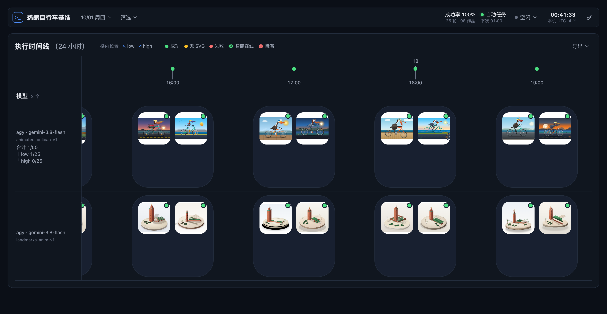
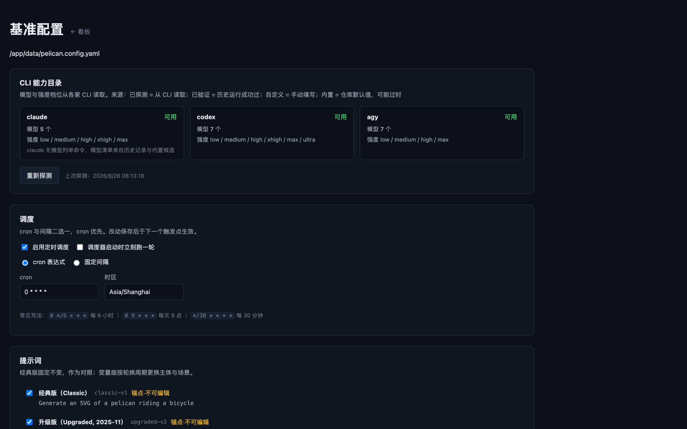
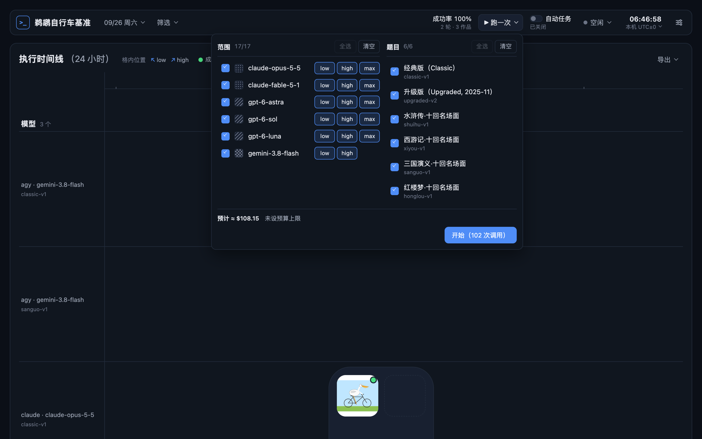
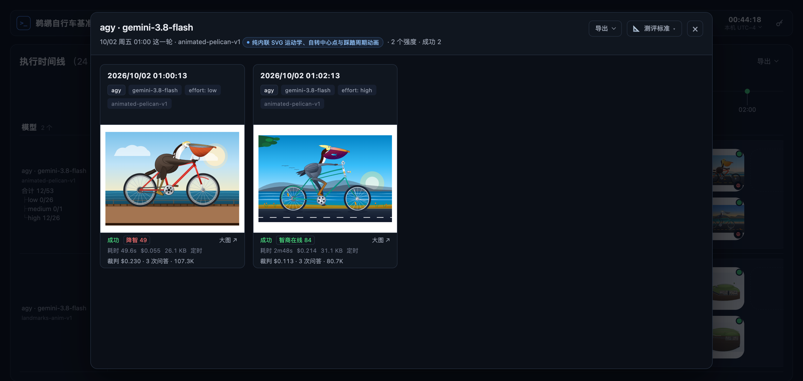

# LLM IQ Dashboard · 鹈鹕自行车基准

定时调用 `agy` / `codex` / `claude` 三家命令行工具，指定模型与思考强度执行**鹈鹕自行车
基准**（pelican-on-a-bicycle），把历次结果以 24 小时时间线的形式呈现在一个看板上。




## 基准出处（Attribution）

提示词逐字使用 Simon Willison 的原文：

```
Generate an SVG of a pelican riding a bicycle
```

- 官方仓库：<https://github.com/simonw/pelican-bicycle>
- 博客标签：<https://simonwillison.net/tags/pelican-riding-a-bicycle/>

完整的来源考证、提示词变体与设计意图见
[`docs/benchmark-provenance.md`](docs/benchmark-provenance.md)。

本仓库是独立实现的自动化执行与观测层，不隶属于原作者、也未获其背书。

## 快速开始

需要 Node 22 或更高（见 `.nvmrc`）与 pnpm 10 或更高。

```bash
pnpm install
pnpm preflight
```

`pnpm install` 结束时按锁文件同步价格目录（见[成本](#成本api-等价)）；断网时只警告，
之后运行 `pnpm pricing:sync` 补上即可。首次加载配置时，`config/pelican.config.yaml`
由起步模板 [`config/pelican.example.yaml`](config/pelican.example.yaml) 生成：三家各一个
轻量模型、low 强度、六道题（经典版与五道前沿视觉题），一轮 18 次调用，并设了每轮与每日的成本上限。

`pnpm preflight` 逐项自查 Node 版本、配置、三家 CLI 是否已安装并登录、价格目录是否就绪，
以及按历史估算的每轮成本；配置用到的 CLI 有问题时给出安装或登录命令，并以非零退出。
`pnpm onboard` 逐家引导登录：没登录的就地启动该 CLI 自带的登录流程，登完立即复查。
不用的 CLI 从配置的 `targets` 里删掉。看板页首提示上的“不再提示”只在当前浏览器隐藏该提示，
不改配置；该 CLI 的目标每轮仍会记一条错误。

先跑一轮确认调用链在你的机器上有效：

```bash
pnpm run:once
```

启动看板（<http://localhost:3000>，生产模式，适合长期挂着看）：

```bash
pnpm dashboard:prod
```

它把当前已提交的 HEAD 检出到同级目录 `../llm_iq_dashboard-deploy`，在那里安装依赖、构建并
`next start`，产物目录与配置仍用本仓库的 `data/` 与 `config/`。未提交的改动不会进生产；
提交后重新运行即可更新。看板有两个视角：不登录只能看结果；配置、跑一次与自动任务
要先配对一台浏览器——在运行看板的机器上执行 `pnpm pair`，把打印的配对码填进看板的
`/pair` 页。看板默认只监听本机（127.0.0.1），公网暴露的方案见
[`docs/security/public-exposure-design.md`](docs/security/public-exposure-design.md)。
修改看板代码时另开开发服务器，端口避开生产看板：

```bash
pnpm dev --port 3001
```

`next dev` 按需编译并保留调试信息，长时间运行内存会涨到数 GB，不适合当常驻看板用。

启动常驻调度（独立进程，与看板互不影响）：

```bash
pnpm scheduler
```

自动任务默认关闭：调度器到点先读 `data/auto-run.json`，开关没打开就跳过，不调用任何 CLI。
在看板工具栏上打开“自动任务”即生效；此时若没有调度器在运行，看板会在后台拉起一个
（日志追加到 `data/scheduler.log`）。关闭只挡住之后的触发点，正在跑的一轮会跑完。
同一时刻只允许一个调度器，一次只跑一轮：手动发起时有轮次在跑直接拒绝；定时到点时有轮次在跑则
排队（只容一轮，排队期间再到点只合并），等它结束立即开跑，工具栏显示“排队中”。

前置条件：配置用到的 `claude`、`codex`、`agy` 在 `PATH` 中且已完成各自的登录。每轮开始
前会预检：没装或未登录的 CLI 不发起调用（未登录时经 profile 的调用照常发起），
被拦下的目标各记一条带安装或登录命令的错误，显示在看板上；
预检命令本身失败（超时、断网）时不拦截，照常发起。

## Docker 部署

```bash
docker compose up -d --build
docker exec -it llm-iq-runner pnpm onboard
docker exec -it llm-iq-runner pnpm pair
```

两个容器共用一个镜像：`llm-iq-web` 只跑看板、开端口；`llm-iq-runner` 装三家 CLI、挂登录态、
不开端口，负责调度与执行，看板发起的一轮经数据卷交给它。镜像不含 CLI，runner 首次启动时从
各家官方渠道安装；各家用订阅账号在 runner 里独立登录一次即可。公开数据仓工作副本通过 bind mount
（`${PELICAN_DATA_REPO_DIR:-../llm-iq-data}:/data-repo`，由可选覆盖文件 `compose.data-repo.yaml` 启用）挂入 runner，容器内脱敏导出并本地提交，
由宿主机安全推送并通过 `pnpm sync:data --confirm-published` 确认发布。配置页「数据仓设置」填了数据仓地址后，
挂进来的是空目录也行，runner 启动时自动 clone。卷、配置、更新与设计取舍见
[`docs/deploy-docker.md`](docs/deploy-docker.md)。

## 公网只读展台部署

若需将看板部署至公网 Serverless 平台（如 Vercel）作为公开成果展台：
数据改从公开数据仓（GitHub raw）按需读取，文件系统只读，不依赖本地 `data/` 目录与常驻进程。

核心环境变量：
- `PELICAN_DATA_SOURCE=remote`：从公开数据仓拉取历史评测与作品，自动启用只读保护。
- `PELICAN_DATA_REPO_URL`：公开数据仓根地址（缺省为 `https://raw.githubusercontent.com/meomeo-dev/llm-iq-data/main`）。
- `PELICAN_READONLY=1`：强制只读部署（写接口 403，配对页面与 API 404，不生成密钥）。

部署前可通过 `pnpm showcase:smoke` 在本地执行完整的只读冒烟校验。
详细部署步骤、安全边界、自检流程与缓存机制参见 [`docs/deploy-public-showcase.md`](docs/deploy-public-showcase.md)。

## 配置

两种方式修改的是同一个文件：



- **配置界面** <http://localhost:3000/config>：选 CLI / 模型 / 思考强度、调度节奏、
  提示词与变量、各 CLI 的超时。保存时在既有 YAML 语法树上改值并保留注释，完整校验
  通过后原子替换；校验不通过时原文件不变。
- **直接编辑** `config/pelican.config.yaml`。它是本机配置、不入库，首次加载时由
  [`config/pelican.example.yaml`](config/pelican.example.yaml) 生成。

`schedule` 只定节奏，到点是否执行只看看板工具栏的“自动任务”开关；`cron` 与
`intervalMinutes` 都不写即不定时。定时轮次与“跑一次”一样在发起时读配置，改动无需重启
调度器：定时目标与题目下一次触发即生效，节奏的改动 30 秒内接手。

| 字段 | 说明 |
| --- | --- |
| `schedule.cron` | cron 表达式，与 `intervalMinutes` 二选一，cron 优先；起步模板为 `0 9 * * *` 每天一轮 |
| `schedule.intervalMinutes` | 固定间隔（分钟） |
| `schedule.timezone` | cron 的时区，留空跟随本机 |
| `schedule.runOnStart` | 调度器启动时是否立刻先跑一轮；须同时设置节奏 |
| `run.promptIds` | 本轮要跑的提示词条目，可多条并行 |
| `run.concurrency` | 同时在跑的模型数上限（按模型分道，见下） |
| `run.defaultTimeoutMs` | 全局默认超时（默认 300 秒） |
| `run.timeoutByCli` | 按 CLI 覆盖超时，如 `codex: 600000` |
| `run.timeoutByEffort` | 按思考强度覆盖超时，如 `max: 2700000`（45 分钟） |
| `run.harnessGuard` | 直出约束（缺省关）：开启后每条提示词末尾另起一段附上要求直接作答的原文（缺省英文，`text` 可改），抑制 CLI 自带的联网、跑代码自测与截图自检；题目原文不改，附加原文记进 `run.json` |
| `judge` | 作品评审（缺省关）：`judge.enabled` 开代码层，`judge.ai.enabled` 开 AI 语义层，`judge.ai.judges` 列裁判（CLI × 模型 × 强度，厂商须与作品不同），`judge.ai.concurrency` 是每个裁判同时评的件数（缺省 5） |
| `profiles` | 第三方上游（中转）：按 CLI 登记环境变量与倍率，目标可指定走哪个上游；只有登录态时不用填 |
| `budget.perRoundUsd` | 每轮 API 等价成本上限（美元），见[成本](#成本api-等价)；不写即不限 |
| `budget.perDayUsd` | 滚动 24 小时的成本上限（美元）；已达上限时整轮不开始 |
| `retention.days` | 历史轮次保留天数（起步模板 30），更早的整轮目录在每轮开始时删除；不写即全部保留 |
| `targets[]` | 被测矩阵，每项是 CLI × 模型 × 思考强度；“跑一次”可从中任选。`enabled: false` 的条目不进定时任务、不默认勾选 |
| `prompts[]` | 自定义提示词与变量 |
| `customModels` | 探测不到的模型手填于此，按 CLI 分组 |

超时优先级：`targets[].timeoutMs` > `run.timeoutByEffort[effort]` > `run.timeoutByCli[cli]`
> `run.defaultTimeoutMs`。各家 CLI 的延迟差异大且随时段波动，因此按 CLI 设置；max 档
的耗时取决于思考深度，因此按强度单独放宽。

并发按模型分道：各 CLI 的限速按模型计算，不同模型并行，同一模型的各强度、各提示词
在自己的道里从 low 到 max 串行。单轮耗时约等于最慢那一道的串行总和。一轮没跑完就到
下一个触发点时，该次触发排队等它结束再跑（队列只容一轮，更多的触发合并）；每小时一轮时，
最慢那一道的串行总和（low + high + 45 分钟的 max）仍要控制在一小时以内，否则轮次会不断顺延。

环境变量 `PELICAN_CONFIG` 覆盖配置文件路径，`PELICAN_DATA_DIR` 覆盖产物目录。

## 提示词

| 条目 | 说明 |
| --- | --- |
| `classic-v1` | Simon Willison 原文 `Generate an SVG of a pelican riding a bicycle`，一字不改，锁定不可编辑，是与外部结果对齐的锚点 |
| `upgraded-v2` | Simon Willison 2025-11-18 发布的升级版原文（加州褐鹈鹕、辐条与车架、喉囊与羽毛、踩踏动作、繁殖羽），已逐字核对 |
| `animated-pelican-v1` | 动态鹈鹕车：带 SMIL 动画的鹈鹕骑行，唯一带评分标准的题目，作品落盘后自动评审（见[作品评审](#作品评审)） |
| `clock-v1` / `penrose-v1` / `ice-water-v1` | 空间与常识视觉题：3:45 的时钟、彭罗斯三角、半杯浮冰水 |
| `four-stroke-engine-v1` 等 7 道 | 前沿工程：四冲程发动机、莫比乌斯小车、倒立摆、赛博魔方、合成波赛道、全息 HUD、黑洞引力透镜 |
| `jwst-deployment-v1` 等 7 道 | 前沿视觉：量子双缝、磁流体尖刺、韦伯望远镜展开、托卡马克、2nm GAA 晶体管、CRISPR-Cas9、脉冲星喷流 |
| `fe-*-v1` / `vfx-*-v1` 14 组 | 2026 前沿单题 140 道：AI、半导体、量子、生物、能源、航空、超材料、神经 8 个工程领域与模拟、光学、几何、科学可视化、运动、系统 6 个特效领域，每组 10 道候选轮换 |
| `landmarks-v1` / `landmarks-anim-v1` | 城市地标微缩景观四十景（静态 / 动态），候选集轮换 |
| `shuihu-v1` | 《水浒传》十个经典回目的名场面，候选集轮换 |
| `xiyou-v1` | 《西游记》十个经典回目的名场面，候选集轮换 |
| `sanguo-v1` | 《三国演义》十个经典回目的名场面，候选集轮换 |
| `honglou-v1` | 《红楼梦》十个经典回目的名场面，候选集轮换 |

起步模板启用 `classic-v1` 与五道前沿视觉题；`run.promptIds` 缺省时只跑 `classic-v1`。
每轮调用数为提示词条数 × 启用的 target 数，在 `run.promptIds` 里增删条目即可调整；
看板上“跑一次”也可以临时只选其中几条。回目清单与出处见
[`docs/benchmark-provenance.md`](docs/benchmark-provenance.md)。

候选集条目（四大名著、前沿单题各组、城市地标）没有变量：每条候选本身就是一句完整的题面，
按轮换周期从候选集里洗牌抽一条，一副取完之前不重复。多久换一次由 `run.rotation` 决定：

| `period` | 行为 |
| --- | --- |
| `day`（默认） | 同一天的各轮共用同一条候选，同一天内的结果可以横向对照；当天首轮（定时或手动）确立取值；“一天”按 `timezone` 划分，默认 `UTC` |
| `run` | 定时每轮都换；手动“跑一次”只预览下一条、不推进轮换，定时序列仍在一副牌内不重复 |

当前周期抽中的候选与洗牌顺序记录在 `data/variable-state.json`，调度器重启或一轮中途
被打断后，同一周期内沿用同一条。每轮实际提问的完整文本写进运行记录，抽中的回目在卡片
上以徽章显示
（如 `回目: 第27回 三打白骨精`）。

配置里的自定义提示词（`prompts:`）仍可带变量，取值方式为 `sequence` / `shuffle` / `random` /
`fixed`，同样按 `run.rotation` 的周期换值。

## 看板

顶部一行工具栏，下面是**当天的 24 小时时间线**与**结果矩阵**，点开格子在模态窗里看
完整结果。设计稿见 `docs/ui/dashboard/`。

- **工具栏**：任何宽度都保持一行。左侧是品牌（窄于 1080px 时只留标识）、日期
  （月历，跑过的日子与今天可以点，格子里标着当天的轮数）与“筛选”。筛选是两级菜单：
  左列是 CLI / 模型 / 强度 / 提示词四个维度及各自的计数，右侧是所选维度的复选清单，
  顶部有“全选”“反选”；有维度被筛掉时按钮徽章显示被筛维度数。右端依次是当天总计
  （成功率 / 轮数与作品数）、执行状态胶囊、时钟与时区菜单、配置图标。
  清单按当天数据列出，配置里停用的提示词的历史结果也能筛。状态点图例在时间线
  标题旁，与格内位置图例并排。
- **导出**：时间线标题右侧的“导出”菜单把当天完整的时间轴泳道存成一张图，包括整条
  24 小时轨道、全部行与文件夹格子，不受窗口宽度和横向滚动限制，内容与当前筛选一致。
  PNG 按 2 倍清晰度栅格化（超出画布上限时自动降倍率），SVG 为矢量原图；缩略图经与
  看板相同的净化后各自以独立图片嵌入。点开格子的结果集同样可导出 PNG / SVG / GIF，
  GIF 按时刻定格各作品的动画帧合成。


- **跑一次**：工具栏上的“▶ 跑一次”展开后选范围（按 CLI · 模型分行，每行逐个勾选强度）
  与题目，按钮上显示本次调用数。默认勾选与定时任务一致（`enabled` 的目标、`run.promptIds`
  的题目），浏览器记住上次的勾选。可选范围是配置里的全部目标（含不进定时任务的）与当前
  可调用的 CLI 的交集。发起后在后台执行，进度见执行状态；已有一轮
  在跑时拒绝发起。
- **自动任务**：工具栏开关，默认关闭，是否定时执行只看它；打开后下行显示下一次触发时刻，
  调度器未运行或配置里没有定时节奏时给出提示。
- **执行状态**：工具栏上的胶囊显示当前轮次“执行中 12/34”，空闲时显示“空闲”。展开后
  按模型分道列出每次调用：排队、执行中（已用 / 超时上限与进度条）、已完成（耗时，左边框
  标成败）；开了 AI 层评审时轮次结束后还有“评审中 k/n”阶段，逐件列结论或未评原因。
  执行进程写 `data/runs/<runId>/progress.json`，看板进程监听它并经
  `GET /api/events`（SSE）推送到页面；执行进程已退出而轮次没跑完时标为“已中断”。每完成
  一次调用，`run.json` 随之更新，结果随即出现在矩阵里。
- **停止本轮**：执行状态面板与“跑一次”菜单里的“停止本轮”点两下生效，手动与定时发起的轮次都可停。
  排队中的调用不再发起，执行中的调用被终止，已完成的结果保留，轮次标为“已停止”。
- **当前时间与时区**：时钟按秒走，点一下回到今天并把时间线滚到“现在”。时区菜单
  列出本机时区、调度时区（`schedule.timezone`）与几个常用时区，并标出 UTC 偏移；
  切换后日期划分、轴上的时刻、卡片时间戳都按新时区重算。所选时区记在浏览器本地，
  默认跟随本机。
- **轴与矩阵共用一条 x 轴**：1 小时缺省 320px，横向滚动，不按窗口压缩；当天轮次挨得近时
  放大小时宽度（最多到 3 倍），让列尽量落在自己的时刻上。每一轮是一列，列中心对准它在
  轴上的准确时刻；仍会重叠时后一列向右推开，轴上的标记留在准确时刻，并以一根连线指回。
  打开看板默认停在今天的“现在”，一条蓝色虚线标出它并每分钟前移；看别的日子时停在所选
  的那一轮。只有换天、换时区或点时钟时才重新定位，数据刷新不会移动正在浏览的视野。
- **按模型分行，格子像 iPhone 文件夹**：行是 `cli · model`（启用多条提示词时每条
  提示词单独一行），行标签固定在左侧不随轨道滚动。每个格子是这个模型在这一轮的全部
  强度，排成 2×2 小图，右上角的点标成败，右下角是评审结论图标（智商在线 / 降智，超过
  三件按结论计数）。四个角对应的档位在当天固定（时间线标题旁的“格内位置 ↖ low ↗ medium
  ↙ high ↘ max”图例），没跑的档位留虚线空位；当天档位多于四个时，第四角显示 “+N”。
  同一角有多个上游的作品时取登录态的作缩略图并标 `×N`。
- **鹈鹕通过率**：带评分标准的题目（动态鹈鹕车）在行标签下显示“合计 智商在线数/测试数”，
  其下按思考强度分列成树状，最多露出四档、更多的在区域内滚动。分母就是当前可见的卡片
  （选定日期、时区与筛选之后，失败与待复核都算在内），可对着格子逐一核算。


- **点击格子**打开模态窗：并排列出这个模型在这一轮各强度的完整卡片，页脚列出成本与评审
  结论；多上游时改为列 = 上游、行 = 强度的矩阵。窗口固定高度，卡片多了在窗内向下滚动，
  页面本身不动；Esc、点遮罩或右上角 × 关闭。
- **单独查看大图**：点卡片上的作品或页脚的“大图 ↗”，在新标签页打开
  `/view/<runId>/<svgFile>`，作品按窗口放大；页上的“原始 SVG ↗”打开模型写出的原文件，
  提示词抽屉显示题目原文与本轮附加的直出约束，评审抽屉列闸门、逐条得分、联系图与裁判成本；
  左右键切同一轮同组合的其余上游。
- 完整卡片尺寸固定：表头、4:3 图框、页脚三段各自定高，失败以同样大小的图框说明原因，
  同一轮的结果可以并排对照。

有调用完成或轮次结束时，页面随即重新载入结果。所选日期记在地址里
（`/?day=2026-09-23`），页面只载入那一天的结果；日历按全部轮次的开始时刻标出保留期内
每天的轮数。

看板与执行的 HTTP 接口清单见 [`docs/development.md`](docs/development.md#接口)。

## 作品评审

缺省关闭，配置页“作品评审”区块打开。只有带评分标准的题目（`animated-pelican-v1`）参与：
作品落盘后代码层用 jsdom 静态分析与 Chromium 定格 8 帧量测车轮、曲柄、循环与脚踏（30 分）；
整轮结束后 AI 语义层由配置的裁判 CLI 看联系图先盲描述、再定位五类部位、最后按 C5–C9
打分（70 分），裁判厂商须与作品不同，作品之间并行。总分 78 及以上判“智商在线”，关键标准
未达门槛直接判“降智”，只过了代码层的为“待复核”。评审记录、联系图与裁判转录各自独立落盘，
不改 `run.json`；评审进程中途退出的队列由下一个执行进程启动时续评，看板在此之前显示
“评审中断”。裁判调用真实消耗配额，历史作品不补评。评分标准在 `src/core/judge/schema.ts`，
设计记录见 [`docs/research/judge/`](docs/research/judge/)。

## 成本（API 等价）

每次调用的 token 用量从 CLI 原始输出解析，随 `run.json` 落盘；看板按价格目录把用量
折算成“API 等价成本”，显示在卡片页脚与单独查看页，悬停可见逐项明细、目录版本，
以及 claude 自报的成本（两者应一致）。

- **口径**：模型厂商自营 API（anthropic-api、openai-api、gemini-api）的按量标价，
  global 地域、基础上下文档，按调用开始时刻取当时生效的价格；与实际经订阅还是 API
  调用无关。claude 的快速模式按 fast 档计。
- **用量**：三家口径统一为互不重叠的计价项（input、缓存读、缓存写、output；推理 token
  含在 output 内）。超时被终止、出错或 CLI 未输出用量的调用显示“—”，不做估算。
  `run.json` 里没有用量的记录从 `.txt` 转录解析，不回写 `run.json`。
- **价格来源**：公开仓库 [meomeo-dev/llm-pricing-catalog](https://github.com/meomeo-dev/llm-pricing-catalog)
  的 Release 附件（`prices.csv`、`model_identifiers.csv`）。`config/pricing-catalog.lock.json`
  锁定 Release tag 与各附件的 sha256，附件缓存在 `data/pricing/<tag>/`，运行时不联网。

```bash
pnpm pricing:sync            # 按锁文件下载并校验（pnpm install 时自动执行）
pnpm pricing:sync --latest   # 改用最新 Release，写回锁文件（随后提交锁文件）
```

**预算**：配置 `budget.perRoundUsd` 与 `budget.perDayUsd` 后，每次发起调用前按该目标
最近 10 次（7 天内）的平均成本预估并占位，会超出任一上限的调用不发起，原因记入
`run.json` 的 `budgetStop` 并显示在执行状态面板；调用结束后以实际成本结算。已发起的
调用会跑完，因此实际花费可能略超上限。近 24 小时已达每日上限时整轮不开始，手动执行
与定时调度都会报出原因。没有历史成本或无法计价的调用按 0 计，不受上限约束。
“跑一次”面板按所选范围与题目显示预计成本与剩余额度；`pnpm preflight` 显示定时任务一轮的预计。

## 数据仓同步

将本地评测结果脱敏导出并同步到公开数据仓（如 `meomeo-dev/llm-iq-data`）。

### 配置

在配置页「数据仓设置」区块填写（或直接改 `config/pelican.config.yaml` 的 `dataRepo` 节点）：

```yaml
dataRepo:
  path: ../llm-iq-data    # 本地数据仓路径（相对路径按 cwd 解析；容器部署时填 /data-repo）
  repository: https://github.com/meomeo-dev/llm-iq-data   # 数据仓地址（可选）：本地路径不存在或为空目录时按它 clone
  autoSync: false         # 评测完成后是否自动触发同步（默认 false）
  push: false             # 同步提交后是否自动 git push 到远程（默认 false）
```

填了 `repository` 时，执行器启动与每次同步前都会核对本地副本：路径不存在或是空目录就按地址 clone，
已是别的仓的副本（`origin` 对不上）则面板报警并拒绝同步，绝不覆盖已有内容。不填则仓库由本地副本的
`origin` 决定。题目白名单 `publishPrompts` 仍只在配置文件里改。

开启 `autoSync: true` 时，`runner` 在每轮评测生成最终 `run.json` 后自动调用同步流水线。若未挂载或不是 Git 仓库则记录清晰日志并跳过；同步失败仅记录日志，不影响评测本身与结果。

### 命令行工具

```bash
# 演练模式（只出报告，任何地方都不写）
pnpm sync:data --repo ../llm-iq-data --dry-run

# 发布确认（匿名 fetch 校验远端包含并回填 published，不导出不提交不推送）
pnpm sync:data --repo ../llm-iq-data --confirm-published

# 同步指定轮次并推送到远程
pnpm sync:data --repo ../llm-iq-data --run 20260927T021708Z --push

# 机器可读 JSON 输出
pnpm sync:data --repo ../llm-iq-data --json
```

退出码含义：
- `0`：同步或发布确认成功；
- `1`：执行失败（如工作区不干净、Git 执行出错、fetch 失败、参数互斥、配置缺失等）；
- `2`：存在因敏感信息拦截而被拒绝发布的轮次或内容冲突。

### 安全边界与脱敏机制

1. **转录绝不外泄**：原始 `.txt` 终端流包含本机路径与会话凭据，公开记录的 `rawFile` 恒为 `null`；用量信息由流水线从转录中提取并回填到 `run.json`。
2. **多层泄漏防护**：
   - 共享扫描规则覆盖本机绝对路径（`local-path`）、私钥块（`private-key`）、云厂商与服务令牌（`secret-pattern`）；
   - 结合三家 CLI 凭据指纹库（`leak-guard`）进行滑窗比对；
   - **SVG 作品**命中任何泄漏规则即取消发布（`svgFile` 置 `null` 并记入 `redactions`）；
   - **`run.json` 文本**中的本机路径先行替换为 `~` 形式，若仍包含敏感路径或命中密钥/令牌，整轮拒绝发布。
3. **数据仓只追加与幂等校验**：
   - 目标轮次目录已存在时，若内容完全一致则幂等跳过；若内容存在差异则判定为冲突，拒绝覆盖并退出报错。
4. **Git 与发布确认（凭据隔离）**：
   - 同步开始前要求数据仓工作区完全干净，且已配置 Git 提交身份（`user.name`/`user.email`）；
   - 容器内不存放任何 GitHub Token 或 SSH 凭据，以 `push: false` 导出并本地提交至 `/data-repo`，台账记录为 `exported`；
   - 宿主机操作者使用自身凭据在宿主机执行 `git push`（人工确认的发布动作）；
   - 推送后通过 `pnpm sync:data --confirm-published`（或 runner 在 `push: false` 自动同步导出后顺带触发），通过公开数据仓匿名 `git fetch` 与 `git merge-base --is-ancestor` 校验提交是否已被远端上游包含，将台账安全转换为 `published`；
   - 本机直跑模式下可传 `--push` 自动快进合并、推送并校验（与 `--confirm-published` 互斥）。
5. **修剪守卫（Retention Guard）**：
   - 调度器过期清理（`retention`）**仅删除台账中标记为 `published` 的轮次**；
   - 尚未发布的过期轮次自动保留并记录日志，防止因断网导致数据丢失；
   - 过期的空目录可删；仅有过程文件而无 `run.json` 的目录予以保留。
6. **永不发布的题目**：
   - 由本工程 `src/core/data-repo/contract.ts` 与数据仓 `validator.mjs` 的 `UNPUBLISHABLE_PROMPT_IDS` 双重阻断，清单内题目的题面与结果永不上传至公开数据仓（详见 `AGENTS.md`）。


## 设计要点

CLI 能力探测与强度折叠、考题与考场规则分离、每次调用一个干净工作目录、SVG 净化、失败
分类与诊断、三家 CLI 的调用方式及其可比性差异，见 [`docs/design-notes.md`](docs/design-notes.md)。

## 目录结构

各目录的职责、运行产物的文件布局与 `runId` 规则见
[`docs/development.md`](docs/development.md#目录结构)。

## 开发

```bash
pnpm lint   # tsc 类型检查，含 test/
pnpm test   # node:test 单元测试，不调用 CLI、不读本机 data/
```

新增一家 CLI 的步骤、测试范围与测试依赖（jsdom）的选型记录见
[`docs/development.md`](docs/development.md)。

## 许可证

[MIT](LICENSE)
