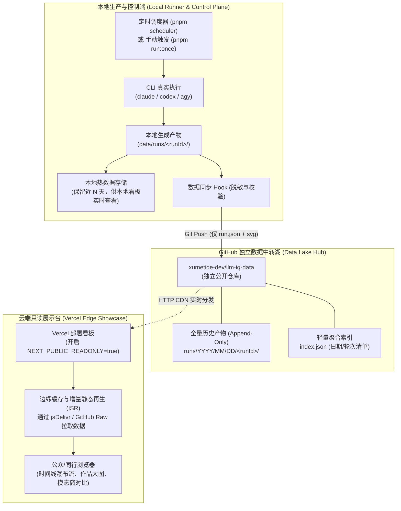
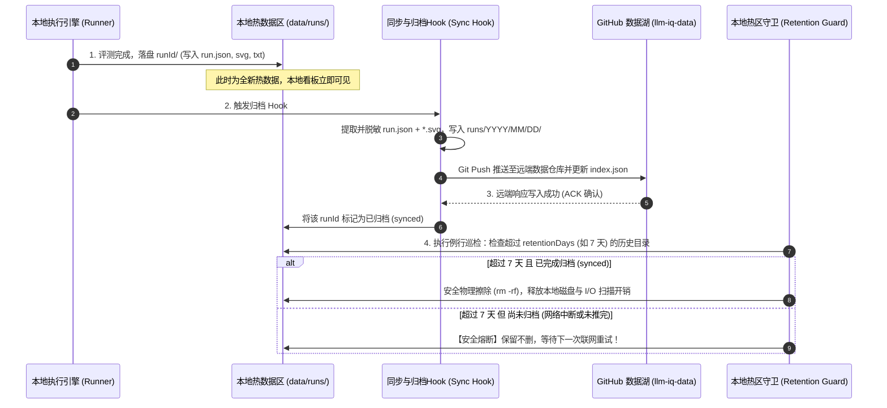

# 大模型评测数据分离与 Vercel 在线展示架构方案

> **状态**：草案 / 架构提案  
> **关联代码仓**：`xumetide-dev/llm-iq-dashboard`（系统源码与本地看板）  
> **关联数据仓**：`xumetide-dev/llm-iq-data`（评测结果、矢量作品与历史归档）  
> **编写时间**：2026-09-27  

---

## 1. 架构背景与核心痛点

随着鹈鹕基准（Pelican on a Bicycle）与 2026 年 14 大前沿工程/视觉特效评测题库（共 140 道题目）的落地，系统面临着**“本地评测执行”**与**“对外公共展示”**之间的工程矛盾：

1. **执行依赖本地环境与私有凭据**：
   基准评测高度依赖本地安装的 `claude`、`codex`、`agy` 等 AI 编程代理 CLI，以及开发者本地的订阅 Token、API 密钥与长达数分钟的计算超时。这些能力无法也不应该在公网云端直接暴露执行。
2. **多协作者并行开发代码**：
   `llm-iq-dashboard` 代码仓库处于高频开发与迭代阶段。如果本地每小时运行产生的评测结果（大量 JSON、SVG）直接提交到代码主干，将导致其他协作者面临频繁的 Git 冲突与 Rebase 灾难。
3. **Git 仓库体积膨胀（Git Bloat）**：
   高频生成的评测记录若沉淀在代码仓历史快照中，会导致代码仓库体积迅速膨胀至数百 MB 甚至 GB 级，严重恶化 `git clone` 与 CI 构建速度。
4. **对外展示需要零成本、高并发与只读安全**：
   对外展示需要支持公众访问、社交分享与学术同行核验，必须具备毫秒级响应、防刷防篡改，且无需承担高额服务器费用。

为彻底解决上述矛盾，本方案确立了**“代码与数据物理分离”**、**“冷热数据分级存储”**与**“生产/中转/展示三层解耦”**的系统架构。

---

## 2. 总体物理拓扑架构

系统划分为三个物理隔离的实体单元：



---

## 3. 冷热数据分层（Hot/Cold Tiering）与确定性切换策略

### 3.1 核心痛点：为什么必须实施严格的冷热物理隔离？
在长时间持续自动化评测（如每整点自动运行一轮）的场景下，若无冷热数据物理隔离，系统将面临严重的技术债：
* **本地文件系统遍历性能坍塌**：看板服务端（`store.ts` 与 `/api/runs`）每次初始化或接收到 SSE 刷新通知时，需通过 `fs.readdir` 扫描 `data/runs/` 目录并逐个解析 `run.json`。若持续累积超过数千轮，单次全量 I/O 与 JSON 结构体重建耗时将从数毫秒飙升至数秒，导致看板卡顿与 Node.js 内存堆膨胀；
* **前端 DOM 与时间线计算开销失控**：一次性向浏览器传递跨越数月的上万个强度槽位数据，会导致虚拟滚动与瀑布流计算帧率严重下跌。

因此，**服务端使用的必须且永远是“受限热数据”，全量历史“只存放在 GitHub 的 `xumetide-dev/llm-iq-data` 仓库中”**。

---

### 3.2 存储分层与分区结构对比

| 存储维度 | 本地生产端：热数据层 (Hot Partition) | GitHub 数据湖：冷归档层 (Cold Archive) |
| :--- | :--- | :--- |
| **存储载体** | 本地磁盘 `data/runs/<runId>/` | 独立公开仓库 `xumetide-dev/llm-iq-data` |
| **保留窗口** | **严格限制在近 N 天（默认 3 ~ 7 天）** | **永久追加保存（Append-Only，永不删除）** |
| **分区拓扑** | 扁平时间戳目录（最大容纳 ~100-200 个 runId） | 时序多级分区树：`runs/YYYY/MM/DD/<runId>/` |
| **I/O 复杂度** | 目录项恒定 $\le 200$，扫描开销为常数时间 $O(1)$ | 单目录项 $\le 48$，规避 GitHub 网页与 Git 树卡顿 |
| **内容完整度** | 包含用于本地复盘的中间态 `.txt` 转录 | 仅保留脱敏后的 `run.json` 与 `*.svg` 成果 |
| **核心用途** | 支撑本地开发调试、即时对比与近期待办 | 支撑长期学术引用、历史智商演进曲线分析 |

---

### 3.3 四步闭环冷热流转与淘汰生命周期

为了保证“数据不丢、热区不膨胀、淘汰有据”，设计如下**四步闭环淘汰管线**：



1. **即时落盘（Write Hot）**：评测结束后第一时间写入本地 `data/runs/<runId>/`，本地看板即刻渲染，零延迟；
2. **脱敏归档（Sanitize & Archive）**：同步脚本按 `YYYY/MM/DD/<runId>` 规则增量提交至 `llm-iq-data`；
3. **安全确认（Safety Verification Gate）**：只有确认 `git push` 到 GitHub 成功后，该轮才被授予“可淘汰凭证”；
4. **热区安全修剪（Hot Eviction）**：本地调度器巡检超过保留期（如 7 天）的历史目录，**仅对已确认同步的轮次执行物理删除**。若遇本地断网或 GitHub API 故障，未同步的目录将被**安全熔断保护**，绝不会因过期而被误删导致数据永久丢失。

---

### 3.4 历史数据按需下钻（On-Demand Cold Lookup）
对于部署在 Vercel 上的在线看板：
* **常态加载**：前端仅从 `llm-iq-data` 的根目录 `index.json` 中拉取最近 7 天的精简索引，瞬时完成渲染；
* **历史追溯**：日历组件解析 `index.json` 中的历史日期存在标记；当访客点击历史上某一天时（如 `2026-06-15`），前端**按需单次直接加载**对应日期目录 `runs/2026/06/15/` 的数据，既实现了“任意历史无限期可查”，又杜绝了一次性将冷数据塞满浏览器内存。


---

## 4. 双端职责与交互行为规范

为确保公网安全与本地控制权，本地看板与云端看板明确区分运行模式：

```
                    ┌────────────────────────────┐
                    │      llm-iq-dashboard      │
                    └──────────────┬─────────────┘
                                   │
                ┌──────────────────┴──────────────────┐
                ▼                                     ▼
   【本地端: Control Plane】               【Vercel端: Read-Only Viewer】
   • 监听: localhost:3001                 • 域名: iq.xxx.vercel.app
   • 单次运行: 完整可用                   • 单次运行: 优雅隐藏 (展示只读徽标)
   • 自动任务: 完整可用 (长驻守护)         • 自动任务: 状态只读灯 (展示更新时刻)
   • 配置管理 (/config): 允许修改         • 配置管理: 屏蔽访问 (403/重定向)
   • 设备配对 (/pair): 允许配对           • 设备配对: 屏蔽访问
```

1. **单次运行（Run Once）**：
   * **本地端**：用户点击触发本地 `runner.ts`，驱动各 CLI 执行；
   * **云端**：界面隐藏“跑一次”按钮，替换为运行节点状态（例如显示：`Runner: 官方集群运行中 | 最后同步于 12 分钟前`）。
2. **开启自动任务（Auto Run Toggle）**：
   * **本地端**：切换本地开关文件，本地 `scheduler.ts` 守护进程常驻调度；
   * **云端**：展示只读指示器（绿灯闪烁表示基准测试自动化在线），防止公网任意访客操纵或刷爆 API 预算。

---

## 5. 数据同步与脱敏流水线

### 5.1 目录组织结构（防目录膨胀）
在 `llm-iq-data` 仓库中，数据按**年/月/日**多级树状结构存储，规避单目录数千子目录引发的 Git 与 GitHub 网页卡顿：

```text
xumetide-dev/llm-iq-data/
├── README.md                      # 仓库说明、数据字段规范与引用指南
├── LICENSE-CODE                   # MIT 许可证（针对同步与数据工具代码）
├── LICENSE-DATA                   # CC-BY-4.0 许可证（针对所有评测数据与 SVG）
├── index.json                     # 顶层元数据清单 (记录所有存在 runs 的日期与统计)
└── runs/
    └── 2026/
        └── 09/
            └── 27/
                ├── 2026-09-27T020000Z/
                │   ├── run.json
                │   ├── claude_sonnet_3_7_high.svg
                │   ├── codex_5_high.svg
                │   └── agy_gemini_2_5_max.svg
                └── 2026-09-27T030000Z/
```

### 5.2 准入与脱敏准则
同步脚本在推送前必须执行确定性过滤：
* **必须同步（Allowlist）**：
  * `run.json`：仅保留模型标识、用量 Token、API 折算成本、运行时长、客观标准绑定与成败状态；
  * `*.svg`：模型生成的自闭合矢量作品；
  * 根目录 `index.json`：增量追加本次运行的摘要。
* **严禁同步（Denylist / 严格拦截）**：
  * `*.txt`：原始 CLI 终端流转录（严防包含本地主机名、用户名、调试输出或提示词泄露）；
  * `.env`、凭证与本地配置文件；
  * 本地临时文件（`*.lock`、`*.staging`、`requests/` 等）。

---

## 6. 开源许可协议策略（Licensing Strategy）

为确保评测数据与工具具备最广泛的开源传播能力，同时避免对衍生分析产生代码层面的传染性，本数据仓库采取**代码与数据双轨开源许可证**：

| 资产类型 | 推荐许可证 | 为什么选择该协议？ | 传染性评估 |
| :--- | :--- | :--- | :--- |
| **代码与脚本**<br/>(Code & Tools) | **MIT License** | 与主看板 `llm-iq-dashboard` 保持一致，极其轻量宽松，允许任何商业与非商业复用。 | **无传染性** |
| **评测数据与矢量作品**<br/>(Datasets & SVG Works) | **CC-BY 4.0**<br/>(知识共享署名 4.0 国际) | 国际公认的科研基准与开放数据集黄金标准（如 HuggingFace、OpenAI 评测集常用）：<br/>1. 允许商业使用、自由二次分发与学术引用；<br/>2. 仅要求明确保留原作者出处署名（Attribution）；<br/>3. **绝无 Copyleft 传染性**（不像 GPL 或 CC-BY-SA 强行要求衍生软件也开源）。 | **无传染性** |

---

## 7. 实施路线图

1. **第一阶段：数据仓库初始化（即刻实施）**
   * 创建同级目录 `../llm-iq-data`；
   * 配置 `LICENSE-CODE` (MIT)、`LICENSE-DATA` (CC-BY-4.0) 及基础说明文档；
   * 初始化 Git 仓库并确立骨架。
2. **第二阶段：本地同步 Hook 与索引工具**
   * 编写轻量同步脚本（如 `scripts/sync-data-repo.mjs`）；
   * 本地评测完成时自动执行脱敏过滤与增量推送到 `llm-iq-data`。
3. **第三阶段：在线看板适配与 Vercel 部署**
   * 看板适配 `DATA_SOURCE=remote` 模式（直接拉取数据仓的 CDN 路径）；
   * 在 Vercel 上一键部署只读公开看板。
