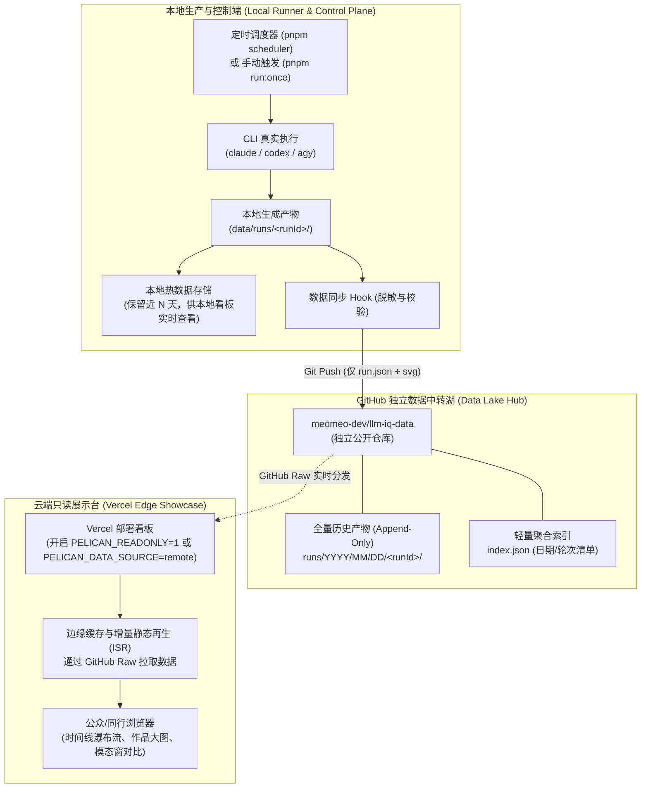
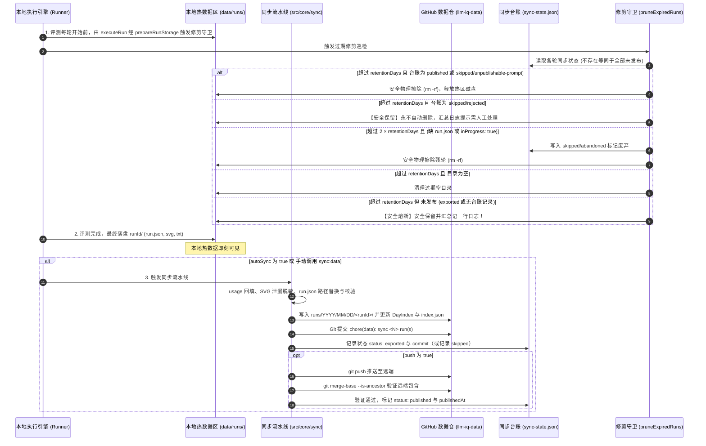

# 大模型评测数据分离与 Vercel 在线展示架构方案

> **状态**：已实施 / 生产就绪架构  
> **关联代码仓**：`meomeo-dev/llm-iq-dashboard`（系统源码与本地看板）  
> **关联数据仓**：`meomeo-dev/llm-iq-data`（评测结果、矢量作品与历史归档）  
> **编写时间**：2026-09-27  

---

## 1. 架构背景与核心痛点

随着鹈鹕基准（Pelican on a Bicycle）与 2026 年 14 大前沿工程/视觉特效评测题库（共 140 道题目）的落地，系统面临着**“本地评测执行”**与**“对外公共展示”**之间的工程矛盾：

1. **执行依赖本地环境与私有凭据**：
   基准评测高度依赖本地安装的 `claude`、`codex`、`agy` 等 AI 编程代理 CLI，以及开发者本地的订阅 Token、API 密钥与长达数分钟的计算超时。这些能力无法也不应该在公网云端直接暴露执行。
2. **多协作者并行开发代码**：
   `llm-iq-dashboard` 代码仓库处于高频开发与迭代阶段。如果本地每小时运行产生的评测结果（大量 JSON、SVG）直接提交到代码主干，将导致其他协作者面临频繁的 Git 冲突与 Rebase 灾难。
3. **Git 仓库体积膨胀（Git Bloat）**：
   高频生成的评测记录若沉淀在代码仓历史快照中，会导致代码仓库体积迅速膨胀至数百 MB 甚至 GB 级，严重恶化 `git clone` 与 CI 构建速度。
4. **对外展示需要零成本、高并发与只读安全**：
   对外展示需要支持公众访问、社交分享与学术同行核验，必须具备毫秒级响应、防刷防篡改，且无需承担高额服务器费用。

为彻底解决上述矛盾，本方案确立了**“代码与数据物理分离”**、**“冷热数据分级存储”**与**“生产/中转/展示三层解耦”**的系统架构。

---

## 2. 总体物理拓扑架构

系统划分为三个物理隔离的实体单元：



---

## 3. 冷热数据分层（Hot/Cold Tiering）与确定性切换策略

### 3.1 核心痛点：为什么必须实施严格的冷热物理隔离？
在长时间持续自动化评测（如每整点自动运行一轮）的场景下，若无冷热数据物理隔离，系统将面临严重的技术债：
* **本地文件系统遍历性能坍塌**：看板服务端（`store.ts` 与 `/api/runs`）每次初始化或接收到 SSE 刷新通知时，需通过 `fs.readdir` 扫描 `data/runs/` 目录并逐个解析 `run.json`。若持续累积超过数千轮，单次全量 I/O 与 JSON 结构体重建耗时将从数毫秒飙升至数秒，导致看板卡顿与 Node.js 内存堆膨胀；
* **前端 DOM 与时间线计算开销失控**：一次性向浏览器传递跨越数月的上万个强度槽位数据，会导致虚拟滚动与瀑布流计算帧率严重下跌。

因此，**服务端使用的必须且永远是“受限热数据”，全量历史“只存放在 GitHub 的 `meomeo-dev/llm-iq-data` 仓库中”**。

---

### 3.2 存储分层与分区结构对比

| 存储维度 | 本地生产端：热数据层 (Hot Partition) | GitHub 数据湖：冷归档层 (Cold Archive) |
| :--- | :--- | :--- |
| **存储载体** | 本地磁盘 `data/runs/<runId>/` | 独立公开仓库 `meomeo-dev/llm-iq-data` |
| **保留窗口** | **按 `retention.days` 配置（起步示例 30 天，可设 null 保留全部）** | **永久追加保存（Append-Only，永不删除）** |
| **分区拓扑** | 扁平紧凑 UTC 目录（如 `20260927T021708Z`） | 时序多级分区树：`runs/YYYY/MM/DD/<runId>/` |
| **I/O 复杂度** | 目录项受保留期控制，保持常数级高效扫描 | 单目录项 $\le 48$，规避 GitHub 网页与 Git 树卡顿 |
| **内容完整度** | 包含用于本地复盘的中间态 `.txt` 转录 | 仅保留脱敏后的 `run.json` 与 `*.svg` 成果 |
| **核心用途** | 支撑本地开发调试、即时对比与近期待办 | 支撑长期学术引用、历史智商演进曲线分析 |

---

### 3.3 四步闭环冷热流转与修剪守卫

为了保证“数据不丢、热区不膨胀、淘汰有据”，流水线实施如下**闭环淘汰管线**：



1. **执行前修剪分级（Retention Guard）**：每轮评测开始前由 `executeRun` 经 `prepareRunStorage` 调用 `pruneExpiredRuns`，按台账状态与超期程度分级修剪：对 `published`、`skipped/unpublishable-prompt` 与 `skipped/empty` 执行物理删除；超过两倍保留期的残轮先在台账补记 `skipped/abandoned` 再删除；`skipped/rejected` 永不自动删除，日志汇总提示人工处理；未发布的轮次熔断保留，防止数据丢失；
2. **即时落盘（Write Hot）**：评测结束后第一时间写入本地 `data/runs/<runId>/`，本地看板即刻渲染，零延迟；
3. **脱敏归档（Sanitize & Archive）**：同步流水线按 `runs/YYYY/MM/DD/<runId>` 规则增量导出脱敏后的 `run.json`（有评审的调用内嵌去掉联系图与裁判转录引用的评审记录 `judge`，ACR-020）与通过检验的 `*.svg`，更新日索引 `DayIndex` 与顶层 `DataRepoManifest`，并生成标准 Git 提交；非预演时不可发布与被拒绝轮次写入台账 `skipped` 记录；
4. **推送与台账确认（Push & Ledger Gate）**：`--push` 时在导出前执行 `git fetch` 与 `git merge --ff-only @{u}`（无上游则跳过，不能快进时中止且零写入）；随后执行 `git push`（绝不使用 force，命令带 120s 超时），无论本次是否有新提交均推送，并通过 `git merge-base --is-ancestor` 逐轮验证远端分支已包含，方在 `<PELICAN_DATA_DIR>/sync-state.json` 台账中更新为 `published`；数据仓已有同内容目录但台账缺失时自动补记为 `exported` 并关联目录最新提交；
5. **发布确认模式（Confirm Published）与宿主机/容器分工**：
   - **容器安全凭据隔离**：容器内不存放任何 GitHub Token 或 SSH 凭据，runner 挂载宿主机数据仓工作副本（`/data-repo`），配置 `autoSync: true` 与 `push: false`，负责本地脱敏导出与提交（台账记录为 `status: exported`）；
   - **宿主机人工发布**：推送操作由宿主机操作者使用自身凭据在宿主机终端执行 `git -C ../llm-iq-data push` 完成，确保公开数据发布经过人工确认；
   - **发布确认回填**：执行 `pnpm sync:data --confirm-published`（或 runner 在 `push: false` 自动同步导出后顺带触发），通过公开数据仓的匿名 `git fetch` 拉取远端引用，基于 `git merge-base --is-ancestor` 校验提交是否已被远端上游分支包含；若已包含，则将台账中对应轮次安全转换为 `status: published` 并记录 `publishedAt`；此模式不导出、不提交、不推送，与 `--push` 互斥，fetch 失败或无上游分支时报错中止且台账不变；
   - **网页同步面板与请求通道（ACR-010）**：所有者看板 `/config` 页新增数据仓面板，支持网页端直接查看健康状态、执行演练（dry-run）、脱敏导出（export）、发布确认（confirm）与带二次确认的推送（push）；分容器部署下经 `data/requests/` 通道由 runner 代办，容器内禁推，须在宿主机推送。

### 3.3.1 同步台账状态表（Sync Ledger States）

台账持久化于 `<PELICAN_DATA_DIR>/sync-state.json`，是本地轮次同步生命周期的唯一事实来源：

| 状态 (`status`) | 原因 (`reason`) | 触发场景与业务含义 | 关键字段 | 下一步流转 |
| :--- | :--- | :--- | :--- | :--- |
| `exported` | - | 本地脱敏完成，已写入数据仓工作副本并生成 Git 提交 | `exportedAt`, `commit`, `redactions` | 推送后祖先校验转为 `published` |
| `published` | - | 已推送到远程仓库，且经远程追踪分支祖先比对确认已包含 | `exportedAt`, `commit`, `publishedAt`, `redactions` | 过期后由修剪守卫安全删除 |
| `skipped` | `unpublishable-prompt` | 整轮题目均在 `UNPUBLISHABLE_PROMPT_IDS` 清单中（如测试题 `leijun-v1`），跳过导出 | `skippedAt`, `reason` | 过期后由修剪守卫安全删除 |
| `skipped` | `empty` | 轮次结束时一次调用都没完成（如刚开始就被取消），没有可发布内容 | `skippedAt`, `reason` | 过期后由修剪守卫安全删除 |
| `skipped` | `rejected` | 命中敏感绝对路径、私钥或令牌样式规则，泄漏扫描拦截拒绝发布 | `skippedAt`, `reason`, `details`（仅含文件与规则名） | **永不自动删除**，需人工核实处理 |
| `skipped` | `abandoned` | 残轮（缺 `run.json` 或 `inProgress: true` 超过保留期两倍），自动标记废弃 | `skippedAt`, `reason` | 标记的同时物理删除释放空间 |

> **注**：执行进程（runner / scheduler）启动时先由 `src/core/run/recover-interrupted.ts` 收尾上次没跑完的轮次——有 `run.json` 的按已停止收尾并自动导出，只有 `progress.json` 的空目录删除——因此 `abandoned` 只剩有产物却缺 `run.json` 的目录。已是 `exported` 或 `published` 的记录严禁被覆盖为 `skipped`；处于 `skipped` 的轮次在后续同步时会重新评估，若题目或扫描规则变更后判定为可导出，则正常导出并覆盖为 `exported`。

### 3.3.2 历史轮次修剪分级表（Tiered Pruning Matrix）

修剪守卫在每轮评测开始前（`prepareRunStorage`）执行，时间依据为 **runId 时刻**（即从紧凑 UTC 目录名解析出的时刻 `runIdTime`），依据保留期天数 `retentionDays` 严格分级：

| 目录与轮次类型 | 台账状态 | 触发条件（以 runId 时刻为准） | 动作与台账变更 | 汇总日志文案 |
| :--- | :--- | :--- | :--- | :--- |
| 正常已完成轮次 | `published` | `now - runIdTime > retentionDays` | 物理删除目录 | 计入`清理了 N 个过期轮次` |
| 正常不可发布轮次 | `skipped/unpublishable-prompt` | `now - runIdTime > retentionDays` | 物理删除目录 | 计入`清理了 N 个过期轮次` |
| 泄漏拦截轮次 | `skipped/rejected` | 任意超期时长 | **安全保留，绝不自动删除** | `保留 N 个被拒绝的过期轮次（需人工处理）` |
| 残轮（缺 run.json 或 inProgress 为 true） | 未记录或非受保护状态 | `now - runIdTime > 2 × retentionDays` | 删除前重读最新台账合并 `skipped/abandoned` 原子保存，物理删除目录 | 计入`清理了 N 个过期轮次` |
| 残轮（缺 run.json 或 inProgress 为 true） | 未记录或非受保护状态 | `now - runIdTime ≤ 2 × retentionDays` | 安全保留 | 无独立日志（静默保留） |
| 读取失败（EACCES 等）或 JSON 损坏 | 任意 | 任意超期时长 | 安全保留，不走残轮分支 | 日志输出具体读取/损坏错误信息 |
| 曾记 abandoned 但 run.json 完整且非 inProgress | `skipped/abandoned` | `now - runIdTime > retentionDays` | 安全保留（按普通未发布轮次保留） | 计入`保留 N 个未发布的过期轮次` |
| 过期空目录 | 无 | `now - runIdTime > retentionDays` | 物理删除目录 | 计入`清理了 N 个过期轮次` |
| 未同步或未发布轮次 | `exported` 或未记录 | `now - runIdTime > retentionDays` | **安全熔断保留** | `保留 N 个未发布的过期轮次` |
| 台账文件不存在 | - | - | 等价于全部未发布，全部保留 | `保留 N 个未发布的过期轮次` |

> **注**：台账已有 `exported`、`published` 或 `skipped(rejected)` 记录的轮次不走 abandoned 分支，不得被改写；修剪复用数据仓动作锁（`data-repo-action-lock`），持锁冲突时跳过本轮修剪。

---

### 3.4 历史数据按需下钻（On-Demand Cold Lookup）
对于部署在 Vercel 上的在线看板（远程只读模式）：
* **服务端拉取与缓存**：服务端请求时从 GitHub Raw 拉取数据，请求配置 Next.js `revalidate` 60 秒，另受 GitHub Raw CDN 自身约 5 分钟缓存影响；单件矢量作品（`/art`）缓存 24 小时；
* **日历计数拉取上界**：日历通过 `listRunStarts` 获取时刻，仅对根清单 `index.json` 中最近 62 天（`CALENDAR_DETAIL_DAYS`）的日期拉取日索引以获得精确时刻；更早的远期日期直接按清单 `days[].runs` 计数合成 UTC 正午时刻（`<date>T12:00:00.000Z`，避免多数时区跨日），将全量日历请求数严格控制在常数上界（≤ 62 次请求）；单个日索引拉取失败时自动降级回退到清单计数合成，不丢弃轮次；
* **历史追溯**：日历组件解析历史日期；当访客点击历史上某一天时（如 `2026-06-15`），前端**按需单次直接加载**对应日期目录 `runs/2026/06/15/` 的数据，既实现了“任意历史无限期可查”，又杜绝了一次性将冷数据塞满浏览器内存。


---

## 4. 双端职责与交互行为规范

为确保公网安全与本地控制权，本地看板与云端看板明确区分运行模式：

```
                    ┌────────────────────────────┐
                    │      llm-iq-dashboard      │
                    └──────────────┬─────────────┘
                                   │
                ┌──────────────────┴──────────────────┐
                ▼                                     ▼
   【本地端: Control Plane】               【Vercel端: Read-Only Viewer】
   • 监听: localhost:3001                 • 域名: iq.xxx.vercel.app
   • 单次运行: 完整可用                   • 单次运行: 优雅隐藏 (展示只读徽标)
   • 自动任务: 完整可用 (长驻守护)         • 自动任务: 状态只读灯 (展示更新时刻)
   • 配置管理 (/config): 允许修改         • 配置管理: 屏蔽访问 (403/重定向)
   • 设备配对 (/pair): 允许配对           • 设备配对: 屏蔽访问
```

1. **单次运行（Run Once）**：
   * **本地端**：用户点击触发本地 `runner.ts`，驱动各 CLI 执行；
   * **云端**：界面隐藏“跑一次”按钮，替换为运行节点状态（例如显示：`Runner: 官方集群运行中 | 最后同步于 12 分钟前`）。
2. **开启自动任务（Auto Run Toggle）**：
   * **本地端**：切换本地开关文件，本地 `scheduler.ts` 守护进程常驻调度；
   * **云端**：展示只读指示器（绿灯闪烁表示基准测试自动化在线），防止公网任意访客操纵或刷爆 API 预算。

---

## 5. 数据同步与脱敏流水线

### 5.1 目录组织结构（防目录膨胀）
在 `llm-iq-data` 仓库中，数据按**年/月/日**多级树状结构存储，规避单目录数千子目录引发的 Git 与 GitHub 网页卡顿：

```text
meomeo-dev/llm-iq-data/
├── README.md                      # 仓库说明、数据字段规范与引用指南
├── LICENSE-CODE                   # MIT 许可证（针对同步与数据工具代码）
├── LICENSE-DATA                   # CC-BY-4.0 许可证（针对所有评测数据与 SVG）
├── index.json                     # DataRepoManifest (记录全量日期清单与总轮数)
└── runs/
    └── 2026/
        └── 09/
            └── 27/
                ├── index.json     # DayIndex (当天各轮次摘要，按 runId 升序)
                ├── 20260927T021708Z/
                │   ├── run.json   # PublicRunRecord (脱敏后的公开运行记录)
                │   ├── claude__claude-sonnet-5__low__classic-v1.svg
                │   ├── codex__gpt-6-luna__low__classic-v1.svg
                │   └── agy__gemini-3.8-flash__low__classic-v1.svg
                └── 20260927T031708Z/
```

### 5.2 准入与脱敏准则
同步流水线在写入与推送前执行确定性过滤：
* **必须同步（Allowlist）**：
  * `run.json`：导出为 `PublicRunRecord`（`publicSchemaVersion: 1`），`rawFile` 恒为 `null`；用量优先保留已有值，缺失时从同名 `.txt` 转录解析回填；顶层 `promptId/promptText` 兼容规范化；
  * `*.svg`：模型生成的自闭合矢量作品（原样复制）；
  * `index.json`：重写受影响日期的 `DayIndex`，并重写根目录 `DataRepoManifest`。
* **脱敏与泄漏扫描机制**：
  * **SVG 作品扫描**：对每个 SVG 进行共享规则（`local-path`、`private-key`、`secret-pattern`）与 `leak-guard` 凭据指纹库比对。命中任一规则时，该作品不予发布（`svgFile` 置 `null`，并在 `redactions` 记录原因）；
  * **`run.json` 脱敏与整轮拦截**：文本中的本机绝对路径自动替换为 `~` 形式；若替换后仍命中路径、私钥或令牌样式规则，则整轮拒绝发布；
  * **幂等与冲突处理**：目标目录已存在且内容完全一致时幂等跳过；内容不一致时判定为冲突，拒绝覆盖并报告。
* **严禁同步（Denylist / 严格拦截）**：
  * `*.txt`：原始 CLI 终端流转录（严防包含本地主机名、用户名、调试输出或会话凭据）；
  * `.env`、凭据文件与本地配置文件；
  * 本地临时文件（`*.lock`、`*.staging`、`requests/` 等）。

### 5.3 永不发布的题目（Unpublishable Prompts）

某些题目属于本地联调、特定主体或测试用途，其题面与作品严禁公开发布：
- **`leijun-v1`**：已从题库移除的测试题，id 保留在清单中以拦截残留的本地历史结果。
- **双重强制保障（二者须严格一致）**：
  1. **本仓库契约控制**：`src/core/data-repo/contract.ts` 中的 `UNPUBLISHABLE_PROMPT_IDS`。同步导出时直接剔除该题目的 attempts，若整轮仅含该题则整轮跳过（`skipped: unpublishable-prompt`），从源头阻断；
  2. **数据仓准入控制**：数据仓 `scripts/lib/validator.mjs` 中的 `UNPUBLISHABLE_PROMPT_IDS`。CI 门禁与提交前校验拒收任何包含此清单题目的 PR 或提交。
- **扩展规范**：题库不收录以真实人物为主体的题目；新增仅供本地测试的题目时，必须同步登记至上述两处清单；严禁使用 `--run` 单独指定、手工复制或修改元数据等任何方式绕过。

---

## 6. 开源许可协议策略（Licensing Strategy）

为确保评测数据与工具具备最广泛的开源传播能力，同时避免对衍生分析产生代码层面的传染性，本数据仓库采取**代码与数据双轨开源许可证**：

| 资产类型 | 推荐许可证 | 为什么选择该协议？ | 传染性评估 |
| :--- | :--- | :--- | :--- |
| **代码与脚本**<br/>(Code & Tools) | **MIT License** | 与主看板 `llm-iq-dashboard` 保持一致，极其轻量宽松，允许任何商业与非商业复用。 | **无传染性** |
| **评测数据与矢量作品**<br/>(Datasets & SVG Works) | **CC-BY 4.0**<br/>(知识共享署名 4.0 国际) | 国际公认的科研基准与开放数据集黄金标准（如 HuggingFace、OpenAI 评测集常用）：<br/>1. 允许商业使用、自由二次分发与学术引用；<br/>2. 仅要求明确保留原作者出处署名（Attribution）；<br/>3. **绝无 Copyleft 传染性**（不像 GPL 或 CC-BY-SA 强行要求衍生软件也开源）。 | **无传染性** |

---

## 7. 当前实施架构

系统已实现全自动化的数据脱敏导出、台账追踪、容器接入与修剪守护架构：

1. **核心同步模块（`src/core/sync/`）**：
   * `leak-scan.ts`：共享泄漏扫描与本机绝对路径脱敏替换；
   * `export-run.ts`：构建 `PublicRunRecord`、旧版记录规范化、用量解析回填与 SVG 脱敏；
   * `data-repo-index.ts`：维护 `DayIndex`、迁移与更新根目录 `DataRepoManifest`；
   * `sync-ledger.ts`：原子维护 `<PELICAN_DATA_DIR>/sync-state.json` 同步台账（支持 exported、published 与 skipped 三态及三种 skip reason）；
   * `data-repo-git.ts`：Git 工作区检查、提交身份校验、规范提交与安全推送；
   * `confirm-published.ts`：基于匿名 fetch 与祖先关系比对的安全发布确认；
   * `sync-orchestrator.ts`：串联候选过滤、幂等判定、冲突检测与完整同步流水线。
2. **命令行工具（`src/bin/sync-data.ts`）**：
   * 支持通过 `pnpm sync:data` 调用，提供 `--repo`、`--dry-run`、`--run`、`--push`、`--confirm-published`、`--json` 参数与结构化状态退出码（0 成功、1 出错、2 拦截或冲突）。
3. **执行引擎与修剪守护**：
   * `src/core/runner.ts`：在每轮评测终稿落盘后，按 `dataRepo.autoSync` 配置自动触发同步；当 `push: false` 时在导出后顺带执行发布确认；若 `/data-repo` 未挂载或非 Git 仓库则输出清晰日志并跳过，具备完全的异常隔离保护；
   * `src/core/retention.ts`：实施修剪分级守卫（过期且 published、skipped/unpublishable-prompt 或 skipped/empty 执行物理删除，rejected 永不自动删除，残轮超 2 倍标记 abandoned 后清理，未发布轮次安全熔断保留）。
4. **所有者看板网页入口与 API（ACR-010）**：
   * `GET /api/data-repo`：所有者聚合查询数据仓工作副本健康度、清单、台账与本地未同步轮次；
   * `POST /api/data-repo/sync`：所有者触发同步动作，支持 dry-run / export / confirm / push 模式，带并发互斥锁与 push 二次提交确认；
   * 分容器部署下经 `data/requests/` 请求通道由执行器代答与执行导出，容器内禁推兜底；
   * `/config` 页提供可视化同步面板、被拦截轮次清单与弹窗二次确认推送。

