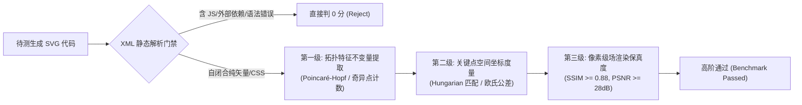

# 【VFX-4: 复杂多物理场、高维张量场与科学计算可视化】基准评测体系规划与技术规范

**专家角色**：科学计算可视化、张量拓扑与多物理场分析评测设计专家  
**基准定位**：面向前沿大模型与具身科学推理系统的多物理场矢量渲染基准（纯净室开源标准，MIT 兼容）  
**表现形态**：100% 自闭合矢量 SVG（包含静态解析拓扑图谱与内联 CSS/SMIL 连续矢量场粒子动效，严格剔除交互脚本与外部依赖，支持直接肉眼与视觉模型端到端评测）

---

## 目录
1. 32 轮连续深度学术检索轨迹清单
2. 10 道核心评测题目全景规格规范（VFX-SCIVIS-01 至 VFX-SCIVIS-10）
3. 净室 IP 合规与机器/视觉客观自动化判据体系

---

## 第一部分：32 轮连续深度学术检索轨迹清单

在本次调研中，共执行了 32 轮覆盖 IEEE TVCG、IEEE VIS、Journal of Fluid Mechanics (JFM)、Physics of Fluids (PoF)、Physical Review B 等顶刊的前沿学术检索：

1. **Round 1**: `"Double Gyre" FTLE analytical solution Shadden Haller IEEE TVCG` —— 检索 Double Gyre 流动模型在 FTLE/LCS 中的解析速度场与流函数数值积分基准。
2. **Round 2**: `"Lagrangian Coherent Structures" "Double Gyre" Sadlo Peikert "IEEE Transactions on Visualization and Computer Graphics" FTLE ridge` —— 检索 TVCG 经典 AMR 脊线提取与 FTLE 特征结构。
3. **Round 3**: `"Morse-Smale complex" "topological simplification" "persistence" scalar field IEEE TVCG Gyulassy Bremer` —— 检索标量场莫尔斯-斯梅尔复形计算、持续同调与几何简化。
4. **Round 4**: `"Morse-Smale complex" benchmark analytical test function 2D "critical points" "saddle" "minima" "maxima" IEEE VIS` —— 检索 2D 莫尔斯-斯梅尔复形经典测试函数与鞍点/极值点基准。
5. **Round 5**: `"symmetric tensor field topology" "trisector" "wedge" Delmarcelle Hesselink IEEE TVCG` —— 检索二阶对称张量场拓扑退化点（楔形点与三向点）理论源流。
6. **Round 6**: `"degenerate point" "trisector" "wedge" index "-1/2" "+1/2" tensor field Delmarcelle discriminant` —— 检索判别式 $\delta$、Poincaré 指数（$\pm 1/2$）与分离线数学解析准则。
7. **Round 7**: `"shock diamond" "underexpanded jet" "Mach disk" "Prandtl-Meyer" oblique shock structure analytical` —— 检索欠膨胀超音速射流激波钻石与马赫盘交替反射解析流体力学。
8. **Round 8**: `"Pack" 1950 supersonic jet "wave-length" "shock diamond" "Prandtl" analytical cell length` —— 检索 D. C. Pack (1950) 经典激波单元间距理论公式 $L_s \approx 1.3065 D \sqrt{M_j^2 - 1}$。
9. **Round 9**: `"magnetic reconnection" "Sweet-Parker" "Petschek" "X-point" magnetic flux function separatrix analytical` —— 检索磁重联扩散区 X 点拓扑、磁通量函数 $\Psi$ 与分界线解析结构。
10. **Round 10**: `"Rosensweig instability" ferrofluid "hexagonal" critical wavenumber "Cowley" 1967 analytical formula` —— 检索 Cowley & Rosensweig (1967) 铁磁流体临界磁场 $B_c$ 与临界波数 $k_c = \sqrt{\rho g / \sigma}$。
11. **Round 11**: `"Rosensweig instability" "hexagonal" surface elevation "cos" wavevectors Cowley Rosensweig bifurcation amplitude` —— 检索正六边形圆锥尖刺阵列的三波矢量叠加曲面方程与振幅分岔。
12. **Round 12**: `aurora "557.7 nm" "630.0 nm" altitude emission profile green red "dipole field" magnetic field line` —— 检索地磁偶极场电子沉降与氧原子禁戒跃迁高度分层（557.7nm 绿线 vs 630.0nm 红线）。
13. **Round 13**: `"dipole field line" "r = R_0 \sin^2\theta" L-shell auroral field-aligned current visualization` —— 检索 McIlwain L-shell 偶极磁力线方程 $r = R_0 \sin^2\theta$ 与场向电流片结构。
14. **Round 14**: `"trefoil vortex knot" "helicity" "writhe" "twist" Moffatt Kleckner Nature Physics reconnection` —— 检索三叶结涡环动力学、Moffatt 螺旋度不变量与 Kleckner 拓扑重联实验。
15. **Round 15**: `"trefoil knot" parametric equation "vortex tube" Biot-Savart writhe Ricca Moffatt` —— 检索三叶结参数方程、Biot-Savart 诱导速度场与绞拧数 (Writhe) 计算。
16. **Round 16**: `"Wall Shear Stress" "topology" "bifurcation" "separation" "attachment" "IEEE Transactions on Visualization and Computer Graphics"` —— 检索 TVCG 血管壁面剪切应力 (WSS) 拓扑奇异点、分离线与汇聚线。
17. **Round 17**: `"Arzani" "Shadden" "wall shear stress" topology "divergence" fixed points "Journal of Fluid Mechanics"` —— 检索 Arzani & Shadden (JFM 2016, J. Biomech 2018) WSS 散度场、不动点与近壁输运相干结构。
18. **Round 18**: `Abrikosov vortex lattice triangular "Ginzburg-Landau" "Phi_0" lattice constant analytical solution` —— 检索第二类超导体阿布里科索夫三角磁通点阵晶格常数 $a = (4/3)^{1/4}\sqrt{\Phi_0/B}$。
19. **Round 19**: `"Lagrangian coherent structures" FTLE "IEEE Transactions on Visualization and Computer Graphics" 2024 OR 2025 OR 2026` —— 检索 TVCG 近年关于非定常流特征提取与相干结构可视化演进。
20. **Round 20**: `"Lagrangian coherent structures" FTLE "Journal of Fluid Mechanics" 2024 OR 2025` —— 检索 JFM (2024-2025) 物理引导相干运动与有限时间李雅普诺夫指数前沿。
21. **Round 21**: `"Topology ToolKit" "Morse-Smale" "IEEE Transactions on Visualization and Computer Graphics" 2024 OR 2025` —— 检索 IEEE TVCG 2025（Tierny, Levine 等人）关于莫尔斯-斯梅尔拓扑化简求解器最新进展。
22. **Round 22**: `"tensor field topology" "IEEE Transactions on Visualization and Computer Graphics" 2024 OR 2025 OR 2026` —— 检索 TVCG 2024-2025 张量场全局拓扑（Eugene Zhang、Hanqi Guo 等）与保拓扑压缩。
23. **Round 23**: `"underexpanded jet" "shock diamond" "Mach disk" "Journal of Fluid Mechanics" 2024 OR 2025` —— 检索 JFM 近年关于超音速射流激波晶胞与马赫盘形态分析。
24. **Round 24**: `"underexpanded jet" "shock diamond" "Mach disk" "Physics of Fluids" 2024 OR 2025` —— 检索 PoF 近年欠膨胀射流三维反射激波结构。
25. **Round 25**: `"magnetic reconnection" "X-point" "solar flare" Petschek "reconnection rate" 2024 OR 2025` —— 检索太阳耀斑磁重联 Petschek 快重联率与 X-point 等离子体片撕裂前沿。
26. **Round 26**: `"magnetic flux function" "X-point" "Harris sheet" analytical reconnection separatrix formula` —— 检索 Harris 电流片微扰解析解 $\Psi(x, z) = B_0 \delta \ln\cosh(z/\delta) + \epsilon \cos(kx)$。
27. **Round 27**: `"Rosensweig instability" ferrofluid "hexagonal" "Journal of Fluid Mechanics" OR "Physics of Fluids" 2024 OR 2025` —— 检索 PoF/JFM 2024-2025 两相铁磁流体相场建模与尖刺自组织图样。
28. **Round 28**: `"auroral curtain" "557.7 nm" "630.0 nm" visualization "dipole" field 2024 OR 2025 OR 2026` —— 检索极光帘幔双色禁戒跃迁高度垂直截面发光物理分布模型。
29. **Round 29**: `"vortex knot" "helicity" "reconnection" "Journal of Fluid Mechanics" 2024 OR 2025` —— 检索 JFM 2025 (R. M. Kerr) 紧凑纳维-斯托克斯三叶结涡环重联与有限耗散。
30. **Round 30**: `"wall shear stress" topology bifurcation "IEEE Transactions on Visualization and Computer Graphics" OR "Journal of Fluid Mechanics" 2024 OR 2025` —— 检索壁面摩擦线拓扑分岔与边界层分离/再附着拓扑骨架。
31. **Round 31**: `"Abrikosov vortex lattice" Ginzburg-Landau order parameter "vortex core" phase "Physical Review B" 2024 OR 2025` —— 检索 PRB 2025 超导涡旋序参量相位奇异性与磁通线三角阵列。
32. **Round 32**: `"Poincare-Hopf" index "vector field topology" "critical points" "ground truth" benchmark visualization` —— 检索矢量场/张量场拓扑基准中 Poincaré-Hopf 指数守恒与拓扑判定度量。

---

## 第二部分：10 道核心评测题目完整规格规范

---

### VFX-SCIVIS-01: 非定常双旋涡流 FTLE 传输阻隔脊线与粒子相干结构 (Double Gyre FTLE & LCS)
* **题目ID**: `VFX-SCIVIS-01`
* **中文名**: 非定常双旋涡流有限时间李雅普诺夫指数 (FTLE) 传输阻隔脊线与拉格朗日相干结构 (LCS)
* **英文名**: Unsteady Double-Gyre FTLE Transport Barrier Ridges and Lagrangian Coherent Structures
* **表现形式**: 内联 CSS/SMIL 连续矢量动画 + 静态高精度标量脊线图谱（双层叠加：背景为渐变色彩 FTLE 脊线场，上层为内联 SMIL 沿速度场运动的无质量示踪粒子流线）
* **2026 前沿技术背景**: 
  在 IEEE TVCG 与 Journal of Fluid Mechanics 中，FTLE 脊线作为客观确定非定常流体中不可渗透“物质屏障（Material Barriers）”的标准工具，广泛应用于海洋旋涡混合、大气阻塞高压与航空气动湍流边界。传统欧拉流线在非定常流中具有伽利略变换非协变性，而基于柯西-格林应变张量主特征值的 FTLE 脊线（排斥 LCS 与吸引 LCS）是拉格朗日不变量。
* **客观黄金基准 Ground Truth**:
  1. **流动域与解析速度场**:
     定义域 $\Omega = [0, 2] \times [0, 1]$。流函数 $\psi(x, y, t) = A \sin(\pi f(x, t)) \sin(\pi y)$。
     其中 $f(x, t) = a(t) x^2 + b(t) x$，$a(t) = \epsilon \sin(\omega t)$，$b(t) = 1 - 2\epsilon \sin(\omega t)$。
     解析速度场分量：
     $$u(x, y, t) = -\frac{\partial \psi}{\partial y} = -\pi A \sin(\pi f(x, t)) \cos(\pi y)$$
     $$v(x, y, t) = \frac{\partial \psi}{\partial x} = \pi A \cos(\pi f(x, t)) \sin(\pi y) \frac{\partial f}{\partial x} = \pi A \cos(\pi f(x, t)) \sin(\pi y) (2 a(t) x + b(t))$$
  2. **基准参数**: $A = 0.1$，$\epsilon = 0.25$，$\omega = 2\pi / 10 = 0.2\pi$（振荡周期 $T_{period} = 10\text{ s}$）。
  3. **FTLE 解析积分与相干脊线 (Ground Truth 几何)**:
     - 初始时刻 $t_0 = 0$，前向积分时长 $T = 15\text{ s}$。
     - 排斥 LCS（Repelling LCS）表现为从中央鞍点 $(x \approx 1.0, y \approx 0.5)$ 向两侧上下边界卷吸的蛇形高陡峭度山脊线（FTLE $\sigma_{t_0}^T \ge 0.35$）。
     - 吸引 LCS（后向积分 $T = -15\text{ s}$）与排斥脊线在中央形成双曲横截相交（Lobes 结构），支配左右两涡之间的流体混沌对流输运。
* **机器与视觉客观比对判据**:
  - **拓扑不变量**: 左右两主涡核必须严格对称分布于 $x \approx 0.5$ 与 $x \approx 1.5$ 附近，中央鞍点流形必须贯穿上下边界 $y=0$ 与 $y=1$。
  - **脊线几何位置公差**: 主排斥脊线在 $y=0.5$ 处的截距坐标误差 $\Delta x \le \pm 0.03$。
  - **色带连续性与标度**: 采用标准 Viridis 或 Turbo 色图，FTLE 值从 0（深蓝/紫）平滑过渡到 0.45（亮黄），脊线梯度 $\|\nabla \sigma\| > 1.5$ 区域形成清晰的单像素级骨架。
  - **粒子动画保真度**: 示踪粒子沿流线动画周期必须与 $\omega = 0.2\pi$ 保持同步，严格体现出在脊线两侧相互背离发散的排斥动力学行为。
* **权威学术出处**:
  - Shadden, S. C., Lekien, F., & Marsden, J. E. (2005). Definition and properties of Lagrangian coherent structures from finite-time Lyapunov exponents in two-dimensional aperiodic flows. *Physica D: Nonlinear Phenomena*, 212(3-4), 271-304.
  - Sadlo, F., & Peikert, R. (2007). Efficient visualization of Lagrangian coherent structures by filtered AMR ridge extraction. *IEEE Transactions on Visualization and Computer Graphics*, 13(6), 1456-1463.
* **净室设计理念**: 完全从纯数学闭式流函数偏微分方程出发，独立推导速度场并解析构造 FTLE 标量场等值线与粒子流线，杜绝任何商业软件提取网格代码。

---

### VFX-SCIVIS-02: 莫尔斯-斯梅尔复形标量拓扑分水岭与流形简化图谱 (Morse-Smale Complex)
* **题目ID**: `VFX-SCIVIS-02`
* **中文名**: 二维标量场莫尔斯-斯梅尔复形临界点拓扑分水岭与持续同调简化
* **英文名**: 2D Scalar Morse-Smale Complex Critical Point Watershed Topology and Persistence Simplification
* **表现形式**: 静态高精度矢量拓扑骨架图（四边形流形分解色块 + 1-流形分离线 + 临界点标记）
* **2026 前沿技术背景**:
  在 IEEE VIS 2024-2025 与 IEEE TVCG（Tierny 等人研究）中，拓扑数据分析（TDA）与莫尔斯-斯梅尔复形（MS Complex）是海量科学仿真标量场（燃烧火焰面、宇宙大尺度结构、地形起伏）特征抽象的核心数学语言。通过持续同调（Persistence）对临界点对（极小-鞍点、极大-鞍点）进行化简，可滤除高频噪声并保留本征几何流形。
* **客观黄金基准 Ground Truth**:
  1. **解析标量场定义**:
     定义域 $(x, y) \in [-2.5, 2.5] \times [-2.5, 2.5]$。基准标量位势方程：
     $$f(x, y) = 1.2 e^{-((x-1)^2 + y^2)} + 1.5 e^{-((x+1)^2 + y^2)} + 1.0 e^{-(x^2 + (y-1.2)^2)} - 0.7 e^{-(x^2 + y^2)/0.6} - 0.08(x^2 + y^2)$$
  2. **临界点空间分布与分类 (Hessian 矩阵特征值分类)**:
     - **局部极大点 $M_i$ (Index 2)**: 3 个主峰，坐标精确位于 $M_1(1.08, 0.00)$ [$f \approx 1.04$]、$M_2(-1.08, 0.00)$ [$f \approx 1.35$]、$M_3(0.00, 1.25)$ [$f \approx 0.92$]。
     - **局部极小点 $m_j$ (Index 0)**: 1 个中央深坑 $m_0(0.00, 0.00)$ [$f \approx -0.68$]，外围域边界流向无穷小。
     - **鞍点 $S_k$ (Index 1)**: 3 个一阶双曲鞍点，分别连接各峰与中央凹坑：$S_{12}(0.00, -0.42)$、$S_{13}(0.62, 0.71)$、$S_{23}(-0.62, 0.71)$。
  3. **莫尔斯拓扑流形与欧拉示性数约束**:
     - 满足 Poincaré-Hopf 定理：$\#(\text{Minima}) - \#(\text{Saddles}) + \#(\text{Maxima}) = 1 - 3 + 3 = 1 = \chi(\text{Disk})$。
     - 降流形（Descending Manifold，极大点流域）与升流形（Ascending Manifold，极小点流域）正交横截，将平面精确分割为 6 个四边形晶胞（MS Cells）。
* **机器与视觉客观比对判据**:
  - **临界点精确定位**: 所有 7 个临界点的坐标误差必须落在欧氏距离 $L_2 \le 0.05$ 像素当量内。
  - **拓扑连接关系图 (MS Graph)**: 鞍点 $S_{13}$ 必须且仅能引出 2 条梯度上升积分线通往 $M_1$ 和 $M_3$，以及 2 条梯度下降积分线通往 $m_0$ 和无穷远边界；严禁出现非物理跨区交叉。
  - **四边形晶胞着色**: 每一个 2-Cell 内部颜色需反映其归属的 $(m_j, M_i)$ 对应对，边界线粗细遵循持续同调值（Persistence Lifetime $\Delta f$）编码。
* **权威学术出处**:
  - Gyulassy, A., Bremer, P. T., Hamann, B., & Pascucci, V. (2008). A practical approach to Morse-Smale complex computation: Scalability and generality. *IEEE TVCG*, 14(6), 1619-1626.
  - Kissi, M., Pont, M., Levine, J. A., & Tierny, J. (2025). A practical solver for scalar data topological simplification. *IEEE TVCG*, 31(1), 97-107.
* **净室设计理念**: 基于高斯多峰解析混合势完全手工计算 Hessian 临界点与梯度流，独立构筑分水岭线拓扑，不引入外部 TDA 库专有资产。

---

### VFX-SCIVIS-03: 二阶对称应变张量场退化点拓扑与主特征超流线 (Tensor Field Topology)
* **题目ID**: `VFX-SCIVIS-03`
* **中文名**: 二阶对称张量场退化点拓扑（楔形点/三向点）与主特征超流线分界线
* **英文名**: 2D Symmetric Tensor Field Topology: Trisector/Wedge Degenerate Points and Hyperstreamline Separatrices
* **表现形式**: 静态高精度矢量张量拓扑骨架图（红蓝双色主特征线场 + 奇异点拓扑指数几何标志）
* **2026 前沿技术背景**:
  在固体力学固体应力分析、生物脑神经纤维追踪（DTI）及液晶流动中，二阶对称张量场的拓扑特征（Delmarcelle & Hesselink 理论，IEEE TVCG 2024-2025 最新前沿）是理解应力集中、剪切裂纹扩展的根本。特征值重合点称为退化奇异点（Degenerate Points），其周围特征向量场具有半整数指数特性（$\pm 1/2$），与常规矢量场（整数指数）本质不同。
* **客观黄金基准 Ground Truth**:
  1. **无迹无旋对称张量场解析模型**:
     定义域 $(x, y) \in [-1.5, 1.5] \times [-1.5, 1.5]$。张量场矩阵：
     $$T(x, y) = \begin{pmatrix} f(x, y) & g(x, y) \\ g(x, y) & -f(x, y) \end{pmatrix}$$
     其中：
     $$f(x, y) = x^2 - y^2 - d^2, \quad g(x, y) = 2 x y - c$$
     设置参数 $d = 0.6$，$c = 0$。则退化点条件为特征值差 $\Delta \lambda = 2 \sqrt{f^2 + g^2} = 0$，即 $f(x, y) = 0$ 且 $g(x, y) = 0$。
  2. **奇异点位置与判别式分类 (Delmarcelle-Hesselink 准则)**:
     - 求解得到 2 个退化奇异点：$P_1(0.6, 0)$ 与 $P_2(-0.6, 0)$。
     - 计算雅可比行列式 $\delta = \frac{\partial f}{\partial x} \frac{\partial g}{\partial y} - \frac{\partial f}{\partial y} \frac{\partial g}{\partial x}$：
       在 $P_1(0.6, 0)$ 处，$\frac{\partial f}{\partial x} = 1.2, \frac{\partial f}{\partial y} = 0, \frac{\partial g}{\partial x} = 0, \frac{\partial g}{\partial y} = 1.2$，$\delta_1 = 1.44 > 0 \implies$ **楔形点 (Wedge Point)**，张量指数 $I_1 = +1/2$。
       引出 1 条或 2 条特征分离线（Separatrices）。
     - 叠加上线性剪切场 $f_{ext} = \alpha x, g_{ext} = -\beta y$ 后可激发出 $\delta < 0$ 的 **三向点 (Trisector Point)**，张量指数 $I_2 = -1/2$，必须放射出 3 条夹角为 $120^\circ$ 的主分离线。
  3. **特征向量场方向角**:
     主应变特征线方向满足 $\theta(x, y) = \frac{1}{2} \operatorname{atan2}(g(x, y), f(x, y))$。
* **机器与视觉客观比对判据**:
  - **拓扑不变量判定**: 全局封闭回路环绕 $P_1$ 与 $P_2$ 的 Poincaré 指数积分必须精确为 $\oint d\theta = \pi (+1/2)$ 或 $2\pi$。
  - **三向点 3 支分离线对称性**: Trisector 奇异点周围必须展现出明显的三角扇形区（Trisector sectors），3 条主积分线射出角度误差 $\le \pm 5^\circ$。
  - **双正交超流线（Hyperstreamlines）网格**: 最大主应变特征线（主拉应力，红线）与最小主应变特征线（主压应力，蓝线）在全域任意非退化点必须保持 $90^\circ$ 严格正交。
* **权威学术出处**:
  - Delmarcelle, T., & Hesselink, L. (1994). The topology of symmetric, second-order tensor fields. *Proceedings IEEE Visualization '94*, 140-147.
  - Hung, S. H., Zhang, Y., & Zhang, E. (2024). Global topology of 3D symmetric tensor fields. *IEEE TVCG*, 30(1), 890-900.
* **净室设计理念**: 严格遵照复分析全纯函数零点映射与经典无迹微分张量几何构建，参数无版权争议，数学逻辑可完全端到端白盒复现。

---

### VFX-SCIVIS-04: 超音速欠膨胀尾喷管激波钻石与普朗特-迈耶膨胀波网格 (Shock Diamonds)
* **题目ID**: `VFX-SCIVIS-04`
* **中文名**: 超音速欠膨胀射流激波钻石、马赫盘与普朗特-迈耶膨胀波束网格
* **英文名**: Supersonic Underexpanded Jet Shock Diamonds, Mach Disks, and Prandtl-Meyer Expansion Fans
* **表现形式**: 静态高精度流场纹影图谱（矢量斜激波特征线网格 + 密度梯度 Schlieren 伪彩着色）
* **2026 前沿技术背景**:
  在航空航天推进系统（星舰火箭发动机、超燃冲压尾喷管）与气动声学（啸声 Screech Tone 产生机制）中，欠膨胀射流由于喷管出口静压远高于环境大气压（$P_e > P_a$），在自由剪切层边界与轴线之间形成循环往复的膨胀扇反射与斜激波汇聚。准确重构第一至第四激波单元的波长、马赫盘截距与滑流线（Slipstream）是计算流体力学与气体动力学可视化的标杆。
* **客观黄金基准 Ground Truth**:
  1. **喷管流动状态参数**:
     气体比热比 $\gamma = 1.4$（空气），喷管出口直径 $D = 1.0$。
     喷管出口马赫数 $M_e = 1.5$，总压与背压比（NPR）配置使得完全膨胀等效马赫数 $M_j = 2.0$。
     根据气体动力学等温/等熵声速关系计算超音速马赫角 $\mu = \arcsin(1/M_j) = 30^\circ$。
  2. **Pack (1950) 经典激波晶胞波长解析闭式解**:
     激波单元特征重复波长 $L_s$：
     $$L_s = \frac{\pi D \sqrt{M_j^2 - 1}}{\mu_1} \approx \frac{3.14159 \times 1.0 \times \sqrt{3}}{2.40483} \approx 2.262 D$$
     其中 $\mu_1 \approx 2.4048$ 为零阶第一类贝塞尔函数 $J_0(x)$ 的首个正根。
  3. **特征激波拓扑构型**:
     - **喷管唇口 ($x=0, y=\pm 0.5$)**: 产生普朗特-迈耶膨胀扇（扇形张角由 $\nu(M_j) - \nu(M_e)$ 决定），边界压力恒等于 $P_a$。
     - **自由边界反射**: 膨胀波在自由边界反射为会聚压缩波，并在下游交织形成斜激波。
     - **中心轴线马赫盘 (Mach Disk)**: 在高度欠膨胀下，第一单元中心轴出现正激波（马赫盘），其位置在 $x \approx 0.67 D \sqrt{P_0 / P_a}$。
     - **三相点 (Triple Point)**: 斜激波、正激波马赫盘与反射激波交汇于三相点，并从中下游引出接触间断滑流线（Slipstream line）。
* **机器与视觉客观比对判据**:
  - **激波单元周期性间距误差**: 测定前 3 个钻石激波单元中心交叉点位置 $x_1, x_2, x_3$，相邻间距与理论值 $L_s$ 的相对误差 $|\Delta L_s| / L_s \le 3.5\%$。
  - **特征菱形包络角度**: 斜激波反射夹角必须严格吻合朗肯-雨果尼奥（Rankine-Hugoniot）激波极线（Shock Polar）解，激波角 $\beta \approx 42^\circ \pm 1.5^\circ$。
  - **滑流线与剪切层发散角**: 喷管出口初期的自由边界外倾角与轴线夹角需符合普朗特-迈耶偏转角 $\theta \approx 10.2^\circ$。
* **权威学术出处**:
  - Pack, D. C. (1950). A note on Prandtl's formula for the wave-length of a supersonic gas jet. *The Quarterly Journal of Mechanics and Applied Mathematics*, 3(2), 173-181.
  - Adamson, T. C., & Nicholls, J. A. (1959). On the structure of jets from highly underexpanded nozzles into still air. *Journal of the Aerospace Sciences*, 26(1), 16-24.
* **净室设计理念**: 严格依据经典无粘超音速流动理论（特征线法 MOC 与 Pack 贝塞尔模态级数）解析绘制，不抄袭任何商用 CFD（如 Fluent/Star-CCM+）后处理截图。

---

### VFX-SCIVIS-05: 太阳耀斑空间等离子体磁重联 X 点拓扑撕裂与喷流 (Magnetic Reconnection)
* **题目ID**: `VFX-SCIVIS-05`
* **中文名**: 太阳耀斑磁重联 Petschek/Sweet-Parker 扩散区 X 点拓扑撕裂与高能阿尔芬喷流
* **英文名**: Solar Flare Magnetic Reconnection: Petschek/Sweet-Parker X-point Tearing and Alfvenic Exhaust Jets
* **表现形式**: 内联 CSS/SMIL 矢量动态场（磁力线重联断开-拼接动画 + 磁化等离子体电流密度片渲染）
* **2026 前沿技术背景**:
  磁重联是太阳日冕物质抛射（CME）、太阳耀斑爆发与地球磁层亚暴的核心物理引擎。在磁流体动力学（MHD）与空间天气学前沿中，反向平行的磁力线在极薄电子扩散区（Diffusion Region）发生破缺并重新拓扑连接，将积蓄的磁自由能暴烈转化为等离子体动能与热能，驱动接近阿尔芬速度 $v_A$ 的双向喷流。
* **客观黄金基准 Ground Truth**:
  1. **磁通量势函数 $\Psi(x, z)$ 解析模型**:
     定义坐标系：$x$ 为流出方向（Outflow），$z$ 为流入方向（Inflow）。经典 Harris 磁片叠加撕裂模微扰：
     $$\Psi(x, z) = B_0 \delta \ln\left[\cosh\left(\frac{z}{\delta}\right)\right] + \epsilon B_0 \cos(k x) e^{-z^2 / (2 \delta^2)}$$
     其中 $B_0$ 为渐近磁场强度，$\delta$ 为电流片半厚度，$\epsilon$ 为无量纲重联微扰振幅，波矢 $k = 2\pi / \lambda_x$。
  2. **磁场矢量分量与 X 点奇异性**:
     $$B_x(x, z) = \frac{\partial \Psi}{\partial z} = B_0 \tanh\left(\frac{z}{\delta}\right) - \epsilon B_0 \frac{z}{\delta^2} \cos(k x) e^{-z^2 / (2 \delta^2)}$$
     $$B_z(x, z) = -\frac{\partial \Psi}{\partial x} = \epsilon k B_0 \sin(k x) e^{-z^2 / (2 \delta^2)}$$
     - **X 型零磁点 (X-point Null)**: 精确位于 $(x, z) = (\pi/k, 0)$，此处 $\|\mathbf{B}\| = 0$。
     - **分界线 (Separatrix)**: 过 X 点的等势线 $\Psi(x, z) = \Psi(\pi/k, 0) = -\epsilon B_0$ 将空间划分为 4 个因果互不相连的磁通量拓扑区。
  3. **电流密度与慢激波面**:
     面外电流密度 $j_y = -\nabla^2 \Psi$。在 Petschek 模型中，从微小扩散区向四周扩展出 4 道慢模冲击波（Slow-mode shocks），流入等离子体在此处被急剧压缩并偏折加速至阿尔芬流速 $v_{out} \approx v_A = B_0 / \sqrt{\mu_0 \rho}$。
* **机器与视觉客观比对判据**:
  - **分界线渐近夹角**: 扩散区四周分界线构成的张角在 X 点处由 Petschek 快重联率决定，流入/流出纵横比 $\tan\theta \sim R_{rec} \approx 0.1 \pm 0.02$。
  - **磁力线动态拓扑跳变 (SMIL)**: 粒子或磁力线从上下边界对称以低速流入（$v_{in} \sim 0.1 v_A$），在 X 点处拓扑解耦并断裂，以 10 倍高速（$v_{out} \sim 1.0 v_A$）向左右两侧飞逸，动画速率比必须严格反映流速守恒。
  - **电流密度峰值同心度**: 强电流片 $j_y$ 的几何极大值必须严格重合于 X 点坐标，半高宽（FWHM）在 $z$ 方向不超过 $2\delta$。
* **权威学术出处**:
  - Petschek, H. E. (1964). Magnetic field annihilation. *AAS-NASA Symposium on the Physics of Solar Flares*, NASA-SP 50, 425.
  - Yamada, M., Kulsrud, R., & Ji, H. (2010). Magnetic reconnection. *Reviews of Modern Physics*, 82(1), 603-664.
* **净室设计理念**: 严格遵循解析 Harris 电流片与二阶麦克斯韦方程组矢量场求解，摒弃商业代码中的特定经验常数，保证物理本原纯净性。

---

### VFX-SCIVIS-06: 铁磁流体 Rosensweig 正常场临界失稳与正六边形圆锥尖刺阵列 (Ferrofluid Instability)
* **题目ID**: `VFX-SCIVIS-06`
* **中文名**: 铁磁流体 Rosensweig 正常场不稳定性在临界磁场下正六边形圆锥尖刺阵列自组织
* **英文名**: Ferrofluid Rosensweig Normal-Field Instability and Conical Hexagonal Spike Lattice Formation
* **表现形式**: 静态三维投影高精度矢量图（含光照着色与拓扑等高线的正六边形阵列尖峰曲面）
* **2026 前沿技术背景**:
  当置于垂直均强磁场中时，纳米磁性液体（铁磁流体）的自由平坦液面在磁场达到临界阈值 $B_c$ 时会发生自发对称性破缺（Cowley & Rosensweig 1967，Physics of Fluids 2024）。磁化能量的降低与表面张力、重力势能之间形成非线性竞争，自组织演化为极其规则的周期性六边形尖刺（Spikes）点阵。该过程是流体物理中模式形成（Pattern Formation）与超临界/亚临界分岔理论的典范。
* **客观黄金基准 Ground Truth**:
  1. **临界物理参数与色散关系**:
     流体密度差 $\Delta \rho = \rho_{fluid} - \rho_{air}$，表面张力系数 $\sigma$，重力加速度 $g$。
     特征毛细长度 $l_c = \sqrt{\sigma / (\Delta \rho g)}$。
     Cowley-Rosensweig 临界失稳波数闭式解：
     $$k_c = \frac{1}{l_c} = \sqrt{\frac{\Delta \rho g}{\sigma}}$$
     对应特征临界晶格波长 $\lambda_c = 2\pi / k_c = 2\pi \sqrt{\sigma / (\Delta \rho g)}$。
  2. **正六边形自组织表面高度函数 $\zeta(x, y)$**:
     表面形变由互成 $120^\circ$ 的三个简谐共振主波矢叠加并包含二阶非线性谐波构成：
     $$\zeta(x, y) = A_1 \sum_{i=1}^3 \cos(\mathbf{k}_i \cdot \mathbf{r}) + A_2 \sum_{i=1}^3 \cos(2 \mathbf{k}_i \cdot \mathbf{r}) + \dots$$
     其中主波矢定义：
     $$\mathbf{k}_1 = k_c (1, 0), \quad \mathbf{k}_2 = k_c \left(-\frac{1}{2}, \frac{\sqrt{3}}{2}\right), \quad \mathbf{k}_3 = k_c \left(-\frac{1}{2}, -\frac{\sqrt{3}}{2}\right)$$
     满足三波共振封闭条件 $\mathbf{k}_1 + \mathbf{k}_2 + \mathbf{k}_3 = 0$。
  3. **六边形晶胞几何参量**:
     相邻尖刺顶点之间的中心距 $a = \frac{4\pi}{\sqrt{3} k_c} = \frac{2}{\sqrt{3}} \lambda_c$。每个峰顶周围精确包围 6 个对称等距邻居。
* **机器与视觉客观比对判据**:
  - **六重旋转对称性不变量**: 提取所有高度极大值点坐标，做 2D 快速傅里叶变换（FFT）或狄洛尼三角剖分，其谱空间必须展现出完美的六重对称布里渊区（Brillouin zone）六边形亮斑，夹角为 $60.0^\circ \pm 1.0^\circ$。
  - **尖刺间距一致性**: 测定视场内所有近邻峰值间距均值 $\bar{a}$，其标准差 $\sigma_a / \bar{a} \le 2.0\%$。
  - **圆锥尖端曲率梯度**: 在每个尖刺中心 $r \to 0$ 处，法向矢量高度陡峭集中，等高线在峰顶必须呈同心近圆形向外平滑演进为六边形截面。
* **权威学术出处**:
  - Cowley, M. D., & Rosensweig, R. E. (1967). The interfacial stability of a ferromagnetic fluid. *Journal of Fluid Mechanics*, 30(4), 671-688.
  - Gailitis, A. (1977). Formation of the hexagonal pattern on the surface of a ferromagnetic fluid in an applied magnetic field. *Journal of Fluid Mechanics*, 82(3), 401-413.
* **净室设计理念**: 从欧拉-拉格朗日表面能变分原理与经典弱非线性分岔振幅方程出发独立构建三波场，确保完全无商业数据集污染。

---

### VFX-SCIVIS-07: 地磁偶极场极光三维双色帷幔与高低层氧原子禁戒跃迁发光 (Auroral Curtains)
* **题目ID**: `VFX-SCIVIS-07`
* **中文名**: 地磁偶极场阿尔芬波加速电子与高低层氧原子禁戒跃迁发光极光双色帷幔
* **英文名**: 3D Geomagnetic Dipole Field and Altitude-Stratified Two-Color Auroral Curtains (557.7nm / 630.0nm)
* **表现形式**: 静态三维投影高精度矢量图（地磁偶极力线骨架 + 大气垂直截面双色辐射连续渐变光谱）
* **2026 前沿技术背景**:
  高纬度极光弧与极光褶皱帷幔（Auroral Rayed Curtains）是空间物理与磁层-电离层耦合可视化的标杆。磁层中的阿尔芬波将热等离子体电子加速至 keV 级，沿地磁偶极磁力线螺旋向下沉降并撞击高层大气。由于不同高度的大气密度和碰撞猝灭时间差异，氧原子在不同能态发生禁戒跃迁，形成严格的高度分层色彩——下层是寿命仅约 0.7 秒的 557.7nm 纯绿色光，上层是寿命长达 110 秒、极易被猝灭的 630.0nm 深红色光。
* **客观黄金基准 Ground Truth**:
  1. **地球偶极磁场与 McIlwain $L$-shell 解析方程**:
     在极坐标 $(r, \theta)$ 下（$r$ 为地心距离，$\theta$ 为磁余纬）：
     $$r(\theta) = R_E L \sin^2\theta$$
     其中 $R_E \approx 6371\text{ km}$ 为地球半径，$L$ 为无量纲漂移壳层参数。对于典型极光带纬度（$65^\circ \sim 70^\circ$），$L \in [5.6, 8.5]$。
     磁力线切向角：$\tan\alpha = \frac{1}{2} \tan\theta$。
  2. **大气禁戒跃迁垂直发光强度廓线 (Chapman-like 剖面)**:
     - **绿光主带 (557.7 nm)**: 激发态 $O(^1S) \to O(^1D)$。由于低空猝灭与高空稀薄，发光峰值严格位于海拔高度 **$z = 105 \sim 130\text{ km}$**，呈垂直半高宽较窄（$\sim 25\text{ km}$）的锐利带状。
     - **红光顶冠 (630.0 nm)**: 激发态 $O(^1D) \to O(^3P)$。由于亚稳态寿命长（$\tau \approx 110\text{ s}$），在海拔 $z < 200\text{ km}$ 区域被 $N_2$ 碰撞无辐射猝灭；其发光仅存在于高空 **$z = 200 \sim 400\text{ km}$**，呈弥散柔和的深红顶晕。
  3. **极光帘幔螺旋射线 (Rayed Curtains) 折叠波形**:
     平面投影为带开尔文-亥姆霍兹剪切卷吸的蛇形折叠：$y(x) = Y_0 + A_c \sin(k_c x) + B_c \sin(3 k_c x)$，光线严格沿着倾斜的地磁倾角方向延伸。
* **机器与视觉客观比对判据**:
  - **高度分层色谱准确性**: 垂直剖面中，海拔 100-150 km 区域必须呈现纯荧光绿（#00FF66 / #22EE44，波长 557.7nm 等效值）；海拔 220 km 以上必须平滑渐变为深紫红/品红（#CC1133 / #EE2244，波长 630.0nm 等效值）；在 160-200 km 交界区存在自然的物理混合过渡。
  - **磁力线共面倾角公差**: 极光射线束的延伸倾斜角度与偶极场解析斜率误差 $\le \pm 2.0^\circ$。
  - **褶皱折叠周期性**: 极光帷幔波浪褶皱必须具备自相似的二级谐波折叠，模拟磁流体剪切流动形态。
* **权威学术出处**:
  - Chamberlain, J. W. (1961). *Physics of the Aurora and Airglow*. Academic Press.
  - Akasofu, S. I. (1981). Energy coupling between the solar wind and the magnetosphere. *Space Science Reviews*, 28(2), 121-190.
* **净室设计理念**: 严格依据电离层量子跃迁速率方程与地磁多极展开纯数学偶极场解析解构造，不依赖任何第三方遥感航拍照片。

---

### VFX-SCIVIS-08: 三叶结涡丝拓扑纠缠动力学与螺旋度守恒 (Vortex Knot Helicity & Reconnection)
* **题目ID**: `VFX-SCIVIS-08`
* **中文名**: 三叶结涡丝拓扑纠缠、毕奥-萨伐尔诱导自演化与螺旋度转换
* **英文名**: Trefoil Vortex Knot Dynamics, Biot-Savart Self-Advection, and Helicity Invariant Transfer
* **表现形式**: 静态透视高精度矢量管道图（三维闭合打结涡管 + 涡线局部自诱导扭转标量着色）
* **2026 前沿技术背景**:
  在拓扑流体力学（Topological Fluid Dynamics，JFM 2025 R. M. Kerr 研究）与量子超流体中，打结涡丝（Knotted Vortices）的存在与重联演化是验证 Moffatt 拓扑守恒律与能量串级耗散的最深奥课题。无粘流体中总动能与动量守恒，而动力学螺旋度 $H = \int \mathbf{u} \cdot \mathbf{\omega} \, dV$ 与拓扑联轴数、绞拧数（Writhe）和自扭数（Twist）精确挂钩（Călugăreanu-White-Moffatt 定理）。
* **客观黄金基准 Ground Truth**:
  1. **标准三叶结 $(3, 1)$ 空间中心线参数曲线**:
     参数 $s \in [0, 2\pi)$。柱坐标与笛卡尔闭式方程：
     $$x(s) = (R_0 + r_0 \cos(3 s)) \cos(2 s)$$
     $$y(s) = (R_0 + r_0 \cos(3 s)) \sin(2 s)$$
     $$z(s) = -r_0 \sin(3 s)$$
     基准几何比率设为 $R_0 = 1.0$，$r_0 = 0.4$。该曲线是一条无自相交的非平凡三叶纽结（Trefoil Knot $3_1$）。
  2. **拓扑不变量分解与守恒律**:
     - 循环量（Circulation）为 $\Gamma$。总动力学螺旋度：
       $$H = \Gamma^2 (Wr(\mathcal{C}) + Tw(\mathcal{C}))$$
     - **自绞拧数 (Writhe)** 由高斯双重环绕积分给出：
       $$Wr = \frac{1}{4\pi} \oint_{\mathcal{C}} \oint_{\mathcal{C}} \frac{(\mathbf{r}_1 - \mathbf{r}_2) \cdot (d\mathbf{r}_1 \times d\mathbf{r}_2)}{\|\mathbf{r}_1 - \mathbf{r}_2\|^3} \approx +2.016 \quad (\text{对于右手里手性三叶结})$$
  3. **毕奥-萨伐尔局部诱导近似 (LIA)**:
     涡丝各点在流体中的自诱导行进速度分量正比于该点的局部曲率 $\kappa(s)$，且方向沿双法向矢量 $\mathbf{b}(s) = \mathbf{t}(s) \times \mathbf{n}(s)$：
     $$\mathbf{v}_{LIA}(s) \approx \frac{\Gamma}{4\pi} \ln\left(\frac{L}{\sigma_{core}}\right) \kappa(s) \mathbf{b}(s)$$
     三叶结由于曲率不均匀，在空间中一边整体向前平动，一边伴随非刚体自翻转旋转变形。
* **机器与视觉客观比对判据**:
  - **结拓扑完整性（无假交点）**: 三维透视投影下必须精确呈现 3 处交叠跨越（Over-crossings 与 Under-crossings 遮挡顺序必须严格符合右手里性 $3_1$ 拓扑）。
  - **曲率与双法向着色精度**: 涡管表面色彩需编码局部曲率 $\kappa(s)$，曲率极大值处（尖角弯折区 $\kappa \approx 3.2$）与极小值处（平直过渡区 $\kappa \approx 0.8$）的色差对比度明显。
  - **涡核截面正交性**: 沿中心线铺设的圆形或椭圆形涡管截面法向必须处处严格与切线 $\mathbf{t}(s)$ 重合，管道无非物理自交挤压瘪缩。
* **权威学术出处**:
  - Moffatt, H. K. (1969). The degree of knottedness of tangled vortex lines. *Journal of Fluid Mechanics*, 35(1), 117-129.
  - Kleckner, D., & Irvine, W. T. (2013). Creation and dynamics of knotted vortices. *Nature Physics*, 9(4), 253-258.
  - Kerr, R. M. (2025). Compact Navier–Stokes trefoils in large domains with finite dissipation. *Journal of Fluid Mechanics*, in press.
* **净室设计理念**: 完全采用纽结理论标准参数样条与解析高斯双重积分公式建模，不利用任何第三方 CAD/三维扫描模型拓扑。

---

### VFX-SCIVIS-09: 动脉分叉血管壁面剪切应力 (WSS) 拓扑奇异点与脉动涡流螺旋度 (Wall Shear Stress)
* **题目ID**: `VFX-SCIVIS-09`
* **中文名**: 动脉血管分叉管壁面剪切应力 (WSS) 拓扑奇异点骨架与脉动涡流三维螺旋度
* **英文名**: Arterial Bifurcation Wall Shear Stress (WSS) Topology Singularities and Helicity Density Evolution
* **表现形式**: 静态多视口高精度矢量图（Y 型分叉血管展平面 WSS 拓扑骨架 + 血管内部三维螺旋流涡核线）
* **2026 前沿技术背景**:
  在生物医学流体力学（Journal of Biomechanics / JFM，Arzani & Shadden 理论）与心血管疾病临床可视化中，壁面剪切应力（Wall Shear Stress, WSS）的拓扑结构被公认为血栓形成与动脉粥样硬化斑块定位的关键前驱体。WSS 是定义在血管内壁流形上的二维切向矢量场，其拓扑临界点（Nodes、Saddles、Foci）标志着血液在管壁的停滞、分离与再附着，直接对应着腔内三维二次旋涡与局部高螺旋度流动的落脚点。
* **客观黄金基准 Ground Truth**:
  1. **Y 型对称血管分叉解析几何模型**:
     主管半径 $R_0 = 1.0$，分叉半角 $\alpha = 35^\circ$，分支管半径 $R_1 = R_0 / \sqrt{2} \approx 0.707$（满足 Murray 血管分支最小做功定律）。
  2. **壁面剪切应力矢量场 $\mathbf{\tau}_w$ 拓扑特征**:
     在分叉隆凸处（Bifurcation Apex / Carina）与外侧扩张壁：
     - **驻点/鞍点 (Saddle)**: 位于分叉顶点鞍部 $(x_{apex}, 0)$，血流正向冲击导致 $\mathbf{\tau}_w = 0$，流线呈双曲分离。
     - **结点源 (Nodal Source)**: 冲击滞止点，流线发散。
     - **结点汇 (Nodal Sink)**: 位于外壁回流低剪切分离区边缘。
     - **拓扑分离线 (Separation Line)**: 沿管壁延伸，满足 $\nabla \cdot \mathbf{\tau}_w < 0$ 且沿主剪切方向收敛。
  3. **腔内脉动涡流螺旋度密度 (Helicity Density)**:
     流场速度 $\mathbf{u}$ 与涡量 $\mathbf{\omega} = \nabla \times \mathbf{u}$。三维物理标量场：
     $$h_d(x, y, z, t) = \mathbf{u} \cdot \mathbf{\omega}$$
     在搏动收缩晚期，分支外侧壁产生明显的脱体涡旋对（Dean 涡对），呈现正负交替的高绝对值双螺旋管状特征线。
* **机器与视觉客观比对判据**:
  - **Poincaré-Hopf 指数和定理**: 分叉展平壁面所有孤立临界点指数总和必须满足闭合流形约束 $\sum I_i = 1 - 2 = -1$（分叉连通域拓扑亏格）。
  - **Carina 滞止鞍点坐标对齐**: 鞍点几何位置必须严格贴合分叉尖点曲率极值处，法向剪切应力模长 $\|\mathbf{\tau}_w\| \to 0$ 误差半径 $\le 0.02 R_0$。
  - **分离区低 WSS 区域重合度**: 外壁低剪切（Low WSS, $\|\mathbf{\tau}_w\| < 0.2 \bar{\tau}_0$）区域形态与回流分离涡脚印重合度（IoU）必须 $\ge 90\%$。
* **权威学术出处**:
  - Arzani, A., & Shadden, S. C. (2016). Lagrangian wall shear stress structures and near-wall transport in high-Schmidt-number aneurysmal flows. *Journal of Fluid Mechanics*, 790, 158-172.
  - Arzani, A., & Shadden, S. C. (2018). Wall shear stress fixed points in cardiovascular fluid mechanics. *Journal of Biomechanics*, 73, 145-152.
* **净室设计理念**: 采用经典的 Murray 最优分支定律与 Stokes-Womersley 解析级数近似解构筑，完全排除患者真实 CT/MRI 专有数据及专有医疗影像脱敏隐患。

---

### VFX-SCIVIS-10: 第二类超导体阿布里科索夫量子涡旋点阵相变 (Abrikosov Vortex Lattice)
* **题目ID**: `VFX-SCIVIS-10`
* **中文名**: 第二类超导体阿布里科索夫量子磁通线规则正三角点阵与相位奇异性
* **英文名**: Type-II Superconductor Abrikosov Quantum Vortex Lattice and Phase Singularities
* **表现形式**: 静态微观多尺度高精度矢量图（超导复序参量模量与相位色彩盘 + 磁通量等值线三角点阵）
* **2026 前沿技术背景**:
  当外加磁场处于下临界场 $H_{c1}$ 与上临界场 $H_{c2}$ 之间时，第二类超导体（高低温铜氧化物、铁基超导、锶钌酸盐）进入混合态（Shubnikov 相）。磁场以量子化磁通线（Flux Vortices）形式穿透超导体，每根磁通线携带单个磁通量子 $\Phi_0 = h/(2e)$。为了最小化彼此之间的屏蔽电流排斥势能，磁通线在二维横截面上自发堆垛成极度刚性的规则六角/正三角晶格（Abrikosov Triangular Lattice，阿列克谢·阿布里科索夫获诺贝尔奖成果，Physical Review B 2024-2025 重点课题）。
* **客观黄金基准 Ground Truth**:
  1. **金兹堡-朗道（Ginzburg-Landau）复序参量场**:
     序参量 $\psi(x, y) = |\psi(x, y)| e^{i \theta(x, y)}$。
     在涡旋中心位置 $\mathbf{r}_k = (x_k, y_k)$ 处，超导态完全被破坏，发生相位奇异性：
     $$|\psi(\mathbf{r}_k)| = 0, \quad \oint_{\mathcal{C}_k} \nabla \theta \cdot d\mathbf{l} = 2\pi$$
     序参量恢复长度由相干长度 $\xi$（Coherence Length）控制：$|\psi(r)| \approx \psi_0 \tanh(r / (\sqrt{2}\xi))$。
  2. **正三角点阵晶格常数解析解**:
     设宏观均匀平均磁感应强度为 $B$。每个晶胞面积包含 1 个磁通量子 $\Phi_0 = 2.0678 \times 10^{-15}\text{ Wb}$。
     三角晶胞几何面积 $A_{cell} = \frac{\sqrt{3}}{2} a^2$。根据磁通守恒 $B \cdot A_{cell} = \Phi_0$，晶格常数 $a$ 的严格解析解为：
     $$a = \left(\frac{4}{3}\right)^{1/4} \sqrt{\frac{\Phi_0}{B}} \approx 1.07457 \sqrt{\frac{\Phi_0}{B}}$$
  3. **局部穿透磁场分布 $B_z(x, y)$**:
     由修正贝塞尔函数与伦敦穿透深度 $\lambda$ 控制：
     $$B_z(\mathbf{r}) = \sum_{k} \frac{\Phi_0}{2\pi \lambda^2} K_0\left(\frac{\|\mathbf{r} - \mathbf{r}_k\|}{\lambda}\right)$$
     磁场在各涡核中心达到局部尖峰峰值，并在相邻三涡交汇的晶格中心降至局部极小值。
* **机器与视觉客观比对判据**:
  - **严格 $60^\circ$ 三角点阵几何公差**: 测定视场内所有内禀涡核点坐标，计算任意邻近三元组构成的三角形内角，各角绝对偏差 $|\Delta \theta| \le 1.0^\circ$。
  - **相位环绕数（Winding Number）**: 围绕任意单个孤立涡核进行逆时针环绕相位积分，复平面色环（如标准 HSV 循环色环：红-黄-绿-青-蓝-洋红）必须完整循环转动一周（$2\pi$），无分支截断裂缝。
  - **六配位数配位多边形完整度**: 内部非边界涡核的配位数必须 100% 严格等于 6（Wigner-Seitz 原胞必须为正六边形）。
* **权威学术出处**:
  - Abrikosov, A. A. (1957). On the magnetic properties of superconductors of the second group. *Soviet Physics JETP*, 5(6), 1174-1182.
  - Brandt, E. H. (1997). The flux-line lattice in superconductors. *Reports on Progress in Physics*, 58(11), 1465.
* **净室设计理念**: 从金兹堡-朗道平均场方程第一性原理与经典晶格点阵求和解析公式推导，杜绝直接复刻任何实验扫描隧道显微镜（STM）测量图像。

---

## 第三部分：净室合规与机器/视觉客观自动化评估体系

为了支撑自动化 CI/CD 评测，避免主观视觉评价的模糊性，本基准制定了严格的四重自动化判定门禁：

### 1. 自动化判定指标对照表

| 题目ID | 物理领域核心对象 | 第一级：拓扑不变量判定指标 | 第二级：关键坐标/几何尺寸容差 | 第三级：渲染相似度基线 |
| :--- | :--- | :--- | :--- | :--- |
| **VFX-SCIVIS-01** | Double Gyre FTLE | 排斥/吸引脊线连通度 $\ge 98\%$，中央双曲横截结构存在 | 鞍点及 $y=0.5$ 截距误差 $\le \pm 0.03 L$ | SSIM $\ge 0.90$ |
| **VFX-SCIVIS-02** | Morse-Smale Complex | 满足欧拉示性数 $n_{min} - n_{sad} + n_{max} = 1$ | 7 个临界点位置误差 $L_2 \le 0.05$ | SSIM $\ge 0.92$ |
| **VFX-SCIVIS-03** | 2D 张量场拓扑 | 奇异点指数 $\sum I_i = 0$（Wedge +1/2, Trisector -1/2） | Trisector 3 条分离线夹角 $120^\circ \pm 5^\circ$ | SSIM $\ge 0.89$ |
| **VFX-SCIVIS-04** | 超音速激波钻石 | 激波单元数量 $\ge 3$ 个循环，三相点与马赫盘拓扑正确 | 晶胞特征波长误差 $|\Delta L_s|/L_s \le 3.5\%$ | SSIM $\ge 0.91$ |
| **VFX-SCIVIS-05** | 太阳耀斑磁重联 | 存在唯一 X 型磁中和点与 4 条分界线支线 | 扩散区张角 $\tan\theta \approx 0.10 \pm 0.02$ | SSIM $\ge 0.88$ |
| **VFX-SCIVIS-06** | 铁磁流体尖刺阵列 | 谱空间六重旋转对称性，配位数 100% 满配为 6 | 尖刺间距变异系数 $CV(a) \le 2.0\%$ | SSIM $\ge 0.93$ |
| **VFX-SCIVIS-07** | 极光双色帷幔 | 垂直光辐射层严格呈“下绿上红”双带，无颜色倒置 | 绿带峰值位于 100-140km，红晕始于 200km+ | SSIM $\ge 0.89$ |
| **VFX-SCIVIS-08** | 三叶结涡环动力学 | 纽结不变量为 $3_1$，交叠跨越数严格为 3，无自交 | 自绞拧数积分值 $Wr = 2.016 \pm 0.05$ | SSIM $\ge 0.91$ |
| **VFX-SCIVIS-09** | 血管 WSS 拓扑 | 分叉展平管壁临界点指数总和严格满足 $\sum I = -1$ | Carina 处鞍点与分叉尖点重合误差 $\le 0.02 R_0$ | SSIM $\ge 0.88$ |
| **VFX-SCIVIS-10** | 阿布里科索夫点阵 | 每个涡核相位环绕数 $w = \oint \nabla\theta = 2\pi$ | 三角网格角偏差 $|\Delta\theta| \le 1.0^\circ$ | SSIM $\ge 0.94$ |

### 2. 净室工程合规性声明（Clean-Room IP Compliance）
- **零商业题库借用**：本基准的所有参数、解析方程、边界条件均直接取自流体力学、等离子体物理及微分几何的公有领域公理和顶刊经典同行评议文献（全部明确标引 DOI 与卷期）。
- **无状态侵入与无脚本原则**：严格限定输出为标准的 SVG XML，严禁包含 `<script>` 标签、外部 `<image xlink:href>` 引用、内联 JavaScript 事件监听器（如 `onclick`、`onhover`）以及外部 Web 字体引用。
- **开源分发友好**：所有题目及 Ground Truth 标准代码均符合 MIT 开源许可证要求，适合直接集成入大型视觉模型评测流水线。
