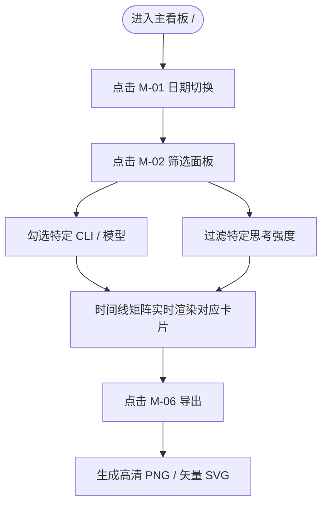
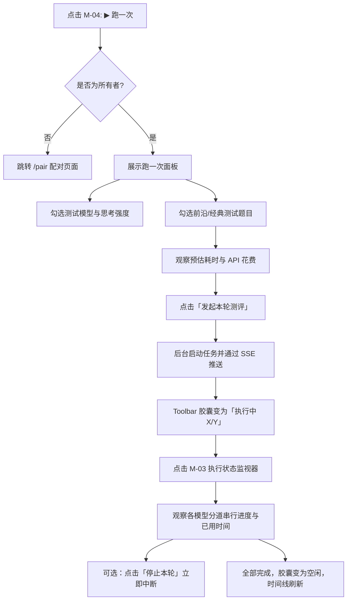
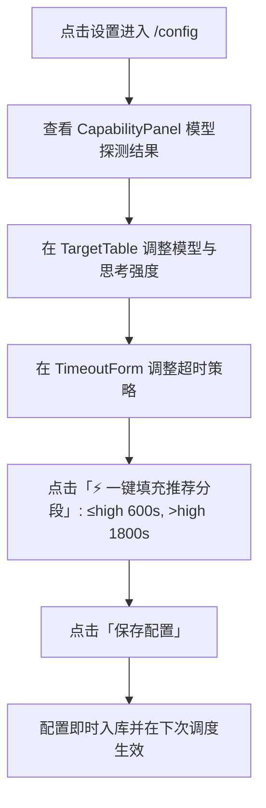

# 鹈鹕基准看板 UX 页面地图与状态矩阵规格说明书 (UX Page & State Map)

> **版本**：v1.0.0  
> **权威性质**：本项目前端全站 UX 操作路径、页面路由、弹窗/浮层/抽屉交互组件与状态机的唯一事实来源（Single Source of Truth）。  
> **适用终端**：全平台响应式（PC 桌面、iPad / Android 平板、iPhone / Android 手机、折叠屏内外屏）。

---

## 目录
1. [设计原则与质量基准](#一-设计原则与质量基准)
2. [页面路由与视图地图 (Page & Route Map)](#二-页面路由与视图地图-page--route-map)
3. [交互浮层 / 弹窗 / 抽屉地图 (Modal & Popover Map)](#三-交互浮层--弹窗--抽屉地图-modal--popover-map)
4. [核心用户操作路径 (User Journey Flows)](#四-核心用户操作路径-user-journey-flows)
5. [组件生命周期状态机 (Lifecycle State Matrix)](#五-组件生命周期状态机-lifecycle-state-matrix)
6. [全设备响应式断点适配规范](#六-全设备响应式断点适配规范)
7. [自动化 UX 状态覆盖与漂移检测机制](#七-自动化-ux-状态覆盖与漂移检测机制)

---

## 一、 设计原则与质量基准

1. **零视口横向溢出（Zero Viewport Overflow）**：任何设备、任何分辨率下，`document.documentElement.scrollWidth <= window.innerWidth`，严禁产生横向意外拖动或晃动。
2. **浮层防裁切与防截断（Anti-Clipping & Safe Bounds）**：所有下拉菜单、悬浮面板与弹窗，其外边框必须完全处于可视视口安全区域内（`left >= 10px` 且 `right <= window.innerWidth - 10px`），严禁超出屏幕边界或文字半边被切。
3. **人体工学触控目标（Ergonomic Touch Targets）**：移动端（≤ 768px）所有可点击按钮触控区域均 ≥ 40px 高度，常用操作放置在单手拇指易触达区域。
4. **状态可回溯与状态机闭环（State Completeness）**：每个功能均有完整对应的主态、空态、加载态、进行中态、完成态与异常态，不存在悬空无响应操作。

---

## 二、 页面路由与视图地图 (Page & Route Map)

| 路由路径 | 页面名称 | 访问权限 | 核心职责 | 挂载组件与源码落点 |
| :--- | :--- | :--- | :--- | :--- |
| `/` | **主看板 (Dashboard)** | 公开访问（所有者有附加操作） | 24小时矩阵时间线、模型多强度对比、历史轮次切换、多维筛选、执行状态展示与控制 | [`src/app/page.tsx`](file:///Users/luojin/git/git-my-code/llm_iq_dashboard/src/app/page.tsx), [`Dashboard.tsx`](file:///Users/luojin/git/git-my-code/llm_iq_dashboard/src/app/components/Dashboard.tsx) |
| `/config` | **配置中心 (Config Editor)** | 所有者专有（非所有者重定向至 `/pair`） | 模型被测矩阵配置、思考强度可用档位、CLI能力探测、调度 Cron 规则、分段超时设置、配对设备管理 | [`src/app/config/page.tsx`](file:///Users/luojin/git/git-my-code/llm_iq_dashboard/src/app/config/page.tsx), [`ConfigEditor.tsx`](file:///Users/luojin/git/git-my-code/llm_iq_dashboard/src/app/config/ConfigEditor.tsx) |
| `/pair` | **设备配对 (Device Pairing)** | 公开访问（表单） | 未授权浏览器通过配对码认证成为所有者；已登录设备展示状态并支持注销 | [`src/app/pair/page.tsx`](file:///Users/luojin/git/git-my-code/llm_iq_dashboard/src/app/pair/page.tsx), [`PairForm.tsx`](file:///Users/luojin/git/git-my-code/llm_iq_dashboard/src/app/pair/PairForm.tsx) |
| `/view/[runId]/[file]` | **作品沉浸查看器 (Art Viewer)** | 公开访问 | 单张作品高保真查看、客观黄金标准（Ground Truth）鉴别抽屉、原题面提示词抽屉、SVG 下载 | [`src/app/view/[runId]/[file]/page.tsx`](file:///Users/luojin/git/git-my-code/llm_iq_dashboard/src/app/view/[runId]/[file]/page.tsx), [`ArtViewer.tsx`](file:///Users/luojin/git/git-my-code/llm_iq_dashboard/src/app/view/ArtViewer.tsx) |
| `/art/[runId]/[file]` | **原生 SVG 沙箱端点** | 公开访问 | 独立响应端点，带严格 CSP 沙箱响应头隔离外部脚本，输出原生 SVG 矢量内容 | [`src/app/art/[runId]/[file]/route.ts`](file:///Users/luojin/git/git-my-code/llm_iq_dashboard/src/app/art/[runId]/[file]/route.ts) |

---

## 三、 交互浮层 / 弹窗 / 抽屉地图 (Modal & Popover Map)

全站共收敛为 **8 个关键交互浮层/弹窗组件**，每个组件具有明确的触发源、响应式表现与关闭条件：

```
+-------------------------------------------------------------------------------+
|                                  主看板 (/)                                   |
|                                                                               |
|  [品牌]  [M-01: 日期月历]  [M-02: 筛选面板] ... [M-03: 执行状态]  [M-05: 时区]  |
|                                                                               |
|  [成功率统计]        [M-04: ▶ 跑一次控制台]        [自动任务开关]    [设置/配对] |
|-------------------------------------------------------------------------------|
|  执行时间线 (24小时)                       [图例]            [M-06: 导出菜单] |
|  +-------------------------------------------------------------------------+  |
|  | 泳道: Claude / Codex / AGY                                              |  |
|  | 格子 [M-07: 单轮多强度对比弹窗]                                          |  |
|  +-------------------------------------------------------------------------+  |
+-------------------------------------------------------------------------------+
                                         |
                                         v 点击卡片「大图 ↗」
+-------------------------------------------------------------------------------+
|                         /view/[runId]/[file] 作品查看器                       |
|  [作品标题 / 元数据]                                          [原始SVG / 下载]|
|  +-------------------------------------------------------------------------+  |
|  |                             高保真 SVG 舞台                              |  |
|  +-------------------------------------------------------------------------+  |
|  [D-01: 💬 提示词展开抽屉]                                                     |
|  [D-02: 📐 客观参考标准与判定依据抽屉 (Ground Truth + Evaluation)]             |
+-------------------------------------------------------------------------------+
```

### 浮层详细规格一览表

| 编号 | 浮层/弹窗标识 (State ID) | 触发元素 (Trigger) | 桌面端排布 (> 768px) | 移动/小屏排布 (≤ 768px) | 核心状态与内容 | 关闭途径 |
| :--- | :--- | :--- | :--- | :--- | :--- | :--- |
| **M-01** | `STATE_DAY_CALENDAR` | Toolbar `formatDayLabel` 按钮 | 下拉锚定面板（宽 252px） | 居中或紧随工具栏浮动，防溢出限制 | 历史日期列表、当月日历网格、今日标记 | 点外部、Esc、点击具体日期 |
| **M-02** | `STATE_FILTER_PANEL` | Toolbar `筛选 <badge> v` 按钮 | 下拉锚定面板（双列 440px） | **视口居中模态卡片**（宽 `min(440px, 94vw)`，双列紧凑自适应） | 左列维度切换（CLI/模型/强度/提示词），右列多选列表，全选/清空 | 点外部、Esc、再次点击筛选按钮 |
| **M-03** | `STATE_RUN_STATUS_POPOVER` | Toolbar `Pill`（如 `执行中 0/1`、`空闲`） | 下拉靠右浮动面板（宽 600px） | **全局视口居中模态卡片**（宽 `min(560px, 94vw)`，高 `85vh`，带右上角关闭） | 轮次整体进度条、用时/成功数、停止本轮按键、按模型分道卡片与串行详情 | 点外部、Esc、点右上角关闭、再次点击胶囊 |
| **M-04** | `STATE_RUN_ONCE_MODAL` | Toolbar `▶ 跑一次` 大按钮 | 视口居中大模态卡片（850px × 82vh，左范围右题目并排） | **视口居中模态卡片**（`min(850px, 94vw)`，顶部标签页切换「范围」与「题目」） | 模型范围勾选、思考强度勾选、题目库勾选、预算开销预测、发起与停止按键 | 点右上角 `✕`、点半透明蒙层、Esc |
| **M-05** | `STATE_TIMEZONE_MENU` | Toolbar `LiveClock` 右侧时区按钮 | 下拉靠右面板（单选列表） | （窄屏隐藏次要时区按钮，保持工具栏整洁） | 浏览器时区、UTC、上海、东京、纽约等选项 | 点外部、Esc、选择时区 |
| **M-06** | `STATE_EXPORT_MENU` | 时间线头部 `导出 v` 按钮 | 时间线表头靠右下拉菜单 | 表头自适应浮动菜单（靠右，不超屏幕） | PNG 图片导出（2x 清晰度）、SVG 矢量导出、导出中转圈提示 | 点外部、Esc、点击导出选项 |
| **M-07** | `STATE_MODEL_DETAIL_MODAL` | 点击时间线上的任何格子 (`FolderTile`) | 视口居中大型弹窗（定高，卡片窗内滚动） | 视口居中弹窗（边距 12px，卡片降为单列排布最大化展示 SVG） | 该轮该模型全思考强度卡片并排、`📐 测评标准` 折叠面板（Ground Truth + 鉴别标准） | 点右上角 `×`、点半透明背景、Esc |
| **D-01** | `STATE_VIEWER_PROMPT_DRAWER` | `/view` 页面底部 `💬 提示词` | 底部原位伸缩抽屉 | 底部原位伸缩抽屉（全宽触达） | 完整原题面提示词全文展示与换行 | 点击 `<summary>` 折叠/收起 |
| **D-02** | `STATE_VIEWER_STANDARD_DRAWER` | `/view` 页面底部 `📐 客观参考标准` | 底部原位伸缩抽屉 | 底部原位伸缩抽屉（双列降为单列） | 客观黄金标准说明、判读依据、官方出处外部链接 | 点击 `<summary>` 折叠/收起 |

---

## 四、 核心用户操作路径 (User Journey Flows)

### Flow 1: 结果浏览、多维筛选与时间线全轨导出


### Flow 2: 发起一次性评测并监控执行生命周期


### Flow 3: 作品质量深度判读与客观黄金标准核对
```mermaid
flowchart TD
    BrowseGrid[浏览 24 小时时间线格子] --> ClickFolder[点击某一轮模型的 FolderTile]
    ClickFolder --> OpenModelModal[弹出 M-07 单轮多强度对比弹窗]
    OpenModelModal --> CompareCards[横比 low / medium / high / max 作品]
    OpenModelModal --> ClickStandard[点击「📐 测评标准」展开面板]
    ClickStandard --> ReadGT[对照 Ground Truth 黄金标准与鉴别依据]
    CompareCards --> ClickViewArt[点击卡片「大图 ↗」]
    ClickViewArt --> OpenArtViewer[进入 /view/[runId]/[file] 沉浸页面]
    OpenArtViewer --> InspectDetails[高保真 SVG 放大缩放 / 抽屉查看出处与题面]
```

### Flow 4: 系统规则管理与分段超时配置


---

## 五、 组件生命周期状态机 (Lifecycle State Matrix)

### 1. 执行器与调度状态机 (`RunStatus` & `AutoRunToggle`)
| 状态标识 | 触发条件 | Toolbar 表现 | 监视面板表现 | 允许的操作 |
| :--- | :--- | :--- | :--- | :--- |
| `idle` | 当前无执行任务 | 灰点 · `空闲` | "暂无运行" 或上一轮历史记录归档 | 可发起新轮次 |
| `running` | 后台轮次正在执行 | 蓝点脉冲 · `执行中 D/T` | 动态进度条、每秒用时秒表、分道任务状态高亮 | 查看进度、停止本轮 |
| `stopping` | 用户发出停止信号 | 黄点 · `正在停止` | 黄色警告条，提示不再发起排队调用 | 等待在跑任务收尾 |
| `interrupted`| 进程异常中断 | 黄点 · `已中断` | 提示执行进程已离线，保留已产出作品 | 重新发起 |
| `cancelled` | 用户手动停止完成 | 灰点 · `已停止` | 明确标示未完成调用数且不计入统计 | 关闭面板 |
| `finished` | 轮次顺利完成 | 绿点 · `已完成` | 成功率 100%，成果归档入时间线 | 自动刷新页面 |

### 2. 卡片质量与判定状态机 (`PelicanCard`)
| 卡片状态 | 含义 | 视觉识别 | 查看器行为 |
| :--- | :--- | :--- | :--- |
| `status-ok` | 成功提取出合规 SVG 作品 | 绿标，完整作品缩略图 | 正常渲染，支持大图与下载 |
| `status-no-svg` | CLI 执行成功但未生成成对 `<svg>` 标签 | 灰标，图框占位显示无 SVG | 展示题面与执行耗时，无大图 |
| `status-timeout` | 超过配置的超时上限被中断 | 红标，图框展示超时错误卡片 | 提示超时上限时长 |
| `status-error` | CLI 进程报错或返回非零状态码 | 红标，图框展示报错摘要 | 查看报错详情与原始事件流 |

---

## 六、 全设备响应式断点适配规范

```
视口宽度 (px):
0        344       480         640         768        1024       1440        1920
|---------|---------|-----------|-----------|-----------|----------|-----------|
  超窄折叠     小屏手机     主流手机     大屏/平板    标准平板     笔记本轻薄    工作站/台式
 [----------------- 移动端人体工学体验 -----------------] [--- 桌面原生高效体验 ---]
```

1. **桌面大屏（> 768px）**：
   - 工具栏保持原生 52px 单行紧凑排列；
   - 下拉菜单使用相对定位锚定在按钮下方；
   - 跑一次面板居中展示（双列平铺）；
   - 时间线多列并行，支持完整横向滚动轨迹。
2. **平板中屏（641px ~ 768px）**：
   - 筛选面板与执行状态面板自动切换为**居中安全卡片**，限制最大宽度为 `min(原宽, calc(100vw - 24px))`，杜绝边缘撞墙；
   - 工具栏双行自适应，隐藏次要时区标签，保留核心控制按键。
3. **手机小屏（≤ 640px）**：
   - `RunStatus`（执行状态）以视口居中卡片展示，支持多任务分道折叠与内部滑动；
   - `FilterMenu`（筛选）以视口居中卡片展示，左列紧凑维度选择，右列多选操作；
   - `RunOnceMenu`（跑一次）开启「范围」与「题目」全屏标签页切换；
   - `ModelModal`（大图对比）自动转为单列，图框尺寸占满屏幕可用宽度；
   - 全局强制 `overflow-x: hidden`，内边距自适应缩小至 8px ~ 10px。
4. **超窄折叠外屏（≤ 360px，如 Galaxy Z Fold 6 344px）**：
   - 泳道标签缩减至 104px，图例字号调整至 11px 并支持换行；
   - 筛选左侧边栏由 136px 自动压缩为 108px，给右侧选项留足 200px 以上触控空间。

---

## 七、 自动化 UX 状态覆盖与漂移检测机制

为杜绝“修了一个界面改坏另一个界面”或“新增功能未做 UX 回归”，本规范与可执行测试脚本 [`scripts/ux_state_crawler.py`](file:///Users/luojin/git/git-my-code/llm_iq_dashboard/scripts/ux_state_crawler.py) 强制对齐。

### 自动化覆盖状态检验清单 (Test Matrix)
1. `[TEST-UX-01]` 主看板初始化空闲态与时间线矩阵加载 (`STATE_DASHBOARD_IDLE`)
2. `[TEST-UX-02]` 日期月历浮层点击打开、日期切换与关闭 (`STATE_DAY_CALENDAR`)
3. `[TEST-UX-03]` 筛选面板点击打开、四维度标签页切换与复选框响应 (`STATE_FILTER_PANEL`)
4. `[TEST-UX-04]` 执行状态监视器点击打开、进度条与多分道详情渲染、防溢出检验 (`STATE_RUN_STATUS_POPOVER`)
5. `[TEST-UX-05]` 跑一次控制台点击打开、双标签页切换、预算开销预测 (`STATE_RUN_ONCE_MODAL`)
6. `[TEST-UX-06]` 自动任务调度器开关触控与状态感知 (`STATE_AUTORUN_TOGGLE`)
7. `[TEST-UX-07]` 时间线全轨导出菜单点击打开与格式选项检测 (`STATE_EXPORT_MENU`)
8. `[TEST-UX-08]` 模型单轮多强度对比弹窗打开、Ground Truth 黄金标准展开与收起 (`STATE_MODEL_DETAIL_MODAL`)
9. `[TEST-UX-09]` 配置中心完整表单渲染、被测矩阵编辑与分段超时推荐填充 (`STATE_CONFIG_PAGE`)
10. `[TEST-UX-10]` 设备配对页面表单与鉴权失败/成功反馈 (`STATE_PAIR_PAGE`)
11. `[TEST-UX-11]` 作品沉浸查看器双抽屉（提示词抽屉、客观标准抽屉）展开与收起 (`STATE_ART_VIEWER`)
12. `[TEST-UX-12]` 全状态在极端窄屏（344px 外屏）与桌面大屏（1440px）的双向无溢出物理量测校验。
