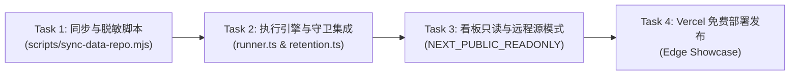

# 项目交接与实施指南 (Handoff Guide)

> **文档定位**：本文件为【大模型评测数据分离、Vercel 在线展示与冷热数据切换】后续实施工程师的**快速上手与交接清单**。  
> **编写日期**：2026-09-27  
> **交接状态**：方案已定稿并评审通过，数据仓库已完成初始化与开源发布，待接手人实施流水线代码。  

---

## 1. 项目全貌与两个核心仓库

本项目包含两个**物理隔离、职责明确**的开源代码/数据仓库：

| 仓库名称 | 本地工作区绝对路径 | GitHub 远程仓库 | 职责与许可范围 |
| :--- | :--- | :--- | :--- |
| **主工程看板仓**<br/>`llm-iq-dashboard` | `/Users/luojin/git/git-my-code/llm_iq_dashboard` | [`xumetide-dev/llm-iq-dashboard`](https://github.com/xumetide-dev/llm-iq-dashboard) | **系统源码与本地控制台**<br/>• Next.js 15 看板、调度器、CLI 适配器、强类型 PromptSchema<br/>• 协议：**MIT License** |
| **独立数据湖仓**<br/>`llm-iq-data` | `/Users/luojin/git/git-my-code/llm-iq-data` | [`xumetide-dev/llm-iq-data`](https://github.com/xumetide-dev/llm-iq-data) | **评测结果与矢量艺术冷归档湖**<br/>• 仅存放脱敏后的 `run.json`、生成的 `*.svg` 与聚合索引 `index.json`<br/>• 协议：**代码 MIT + 数据/作品 CC-BY-4.0**（均无传染性） |

---

## 2. 核心架构方案与设计纪律

接手前请先完整阅读权威方案：
📄 **[`docs/data-sync-architecture.md`](docs/data-sync-architecture.md)**

### 必须坚守的三条铁律：
1. **代码仓与数据仓物理隔离（禁止代码污染）**：
   * 严禁将评测生成的运行记录（`data/runs/`）提交到 `llm-iq-dashboard` 主代码仓；
   * 其他协作者正在主代码仓中开发其他功能，任何运行数据只能推往同级目录的 `llm-iq-data` 仓库。
2. **冷热数据分层（服务端只读热数据，杜绝性能衰退）**：
   * **本地服务端热区**：`data/runs/` 只保留最近 **3 ~ 7 天** 的热数据，文件数严格控制在 $\le 200$，确保 `fs.readdir` 扫描耗时为常数时间 $O(1)$，内存开销恒定；
   * **远端数据湖冷区**：`llm-iq-data` 采用 **`runs/YYYY/MM/DD/<runId>/`** 多级时序分区，只追加永不删除，沉淀全量历史。
3. **零丢失安全修剪门禁（Safety Fuse）**：
   * 本地调度器在修剪超过 7 天的历史目录时，**必须确认该轮次已成功同步到 GitHub（`synced` 状态）**；若因断网未同步，必须熔断保留，绝不物理误删。

---

## 3. 接手人待实施任务清单 (Actionable Checklist)

接手工程师需要按照以下四个任务模块逐项实施与收口：



### Task 1: 编写数据同步与脱敏归档脚本 (`scripts/sync-data-repo.mjs`)
* **目标**：实现一个轻量、幂等的 Node.js 脚本，可手动执行也可由程序调用。
* **实现逻辑**：
  1. 扫描本地 `data/runs/<runId>/`；
  2. 检查每一轮是否已在同级目录 `../llm-iq-data` 中归档；
  3. **严格脱敏过滤**：
     * **白名单提取**：复制 `run.json` 和所有的 `*.svg` 矢量文件到 `../llm-iq-data/runs/YYYY/MM/DD/<runId>/`；
     * **黑名单拦截**：**坚决过滤**所有 `*.txt` 原始终端转录、`.env` 变量、lock 文件；
  4. **增量更新索引**：解析本次同步的 run 元数据，追加更新 `../llm-iq-data/index.json`（更新 `totalRuns`、`updatedAt`、日期列表）；
  5. **Git 提交并推送**：在 `../llm-iq-data` 内执行 `git add .`、`git commit -m "chore(data): sync run <runId>"` 并 `git push origin main`；
  6. 同步成功后，在本地该 `data/runs/<runId>/` 下生成一个轻量标记 `.synced`（或记录在本地同步状态表）。

---

### Task 2: 执行引擎与本地修剪守卫集成
* **目标**：实现“本地跑完自动触发同步”与“未归档不误删”。
* **代码落点**：
  1. [`src/core/runner.ts`](src/core/runner.ts)：在整轮评测结束写入 `run.json` 后，派生或异步调用 `scripts/sync-data-repo.mjs`；
  2. [`src/core/retention.ts`](src/core/retention.ts)：改造 `pruneExpiredRuns` 方法：
     * 原逻辑：直接删除超过 `retentionDays` 的目录；
     * 新逻辑：判断该目录是否存在 `.synced` 归档标记。只有同时满足 `已过期 && 已同步` 才执行 `fs.rm`；若未同步则跳过并输出日志警告。

---

### Task 3: 前端适配只读展板与远程数据源模式
* **目标**：支持在 Vercel 等公网环境作为只读安全展示台。
* **代码落点与改动点**：
  1. **只读模式开关 (`NEXT_PUBLIC_READONLY=true`)**：
     * [`src/app/components/run-control/RunOnceMenu.tsx`](src/app/components/run-control/RunOnceMenu.tsx)：在只读模式下隐藏“跑一次”弹出层，或替换为只读状态徽章；
     * [`src/app/components/run-control/AutoRunToggle.tsx`](src/app/components/run-control/AutoRunToggle.tsx)：隐藏操作开关，仅展示状态小圆点（绿色运行中 / 灰色停止）；
     * [`src/app/config/`](src/app/config/) 与 [`src/app/pair/`](src/app/pair/)：在中间件或页面入口拦截，只读模式下直接重定向到首页或报 403。
  2. **远程数据拉取适配 (`DATA_SOURCE=remote`)**：
     * 改造 [`src/core/store.ts`](src/core/store.ts) 或增加远程适配器：
     * 当处于云端部署时，不读取本地文件系统，而是通过 `fetch('https://raw.githubusercontent.com/xumetide-dev/llm-iq-data/main/index.json')` 获取最近 7 天数据；
     * SVG 图片的 `src` 路径自动映射至 GitHub Raw 或 jsDelivr CDN 链接：
       `https://cdn.jsdelivr.net/gh/xumetide-dev/llm-iq-data@main/runs/YYYY/MM/DD/<runId>/<file>.svg`。

---

### Task 4: 部署到 Vercel (Edge Showcase)
* **目标**：零成本托管、全球 CDN 加速的在线展板。
* **步骤**：
  1. 登录 Vercel 控制台，选择 **Import Git Repository**，关联 `xumetide-dev/llm-iq-dashboard`；
  2. 配置环境变量：
     * `NEXT_PUBLIC_READONLY=true`（启用只读安全保护）
     * `DATA_SOURCE=remote`
     * `DATA_REPO_URL=https://raw.githubusercontent.com/xumetide-dev/llm-iq-data/main`
  3. 点击 **Deploy**。通过 Next.js 的 ISR（增量静态再生），设置 60 秒自动重新拉取远端数据仓。

---

## 4. 必备质量验收门禁 (Verification Gates)

在提交任何代码改动前，必须依次跑通以下所有质量门禁：

```bash
# 1. 题库 Schema 严格校验 (183 项单题/候选/标准校验，必须 0 error)
pnpm validate:prompts

# 2. TypeScript 静态类型检查
pnpm lint

# 3. 自动化测试套件 (29 个测试套件、145 项测试，必须 100% Pass)
pnpm test

# 4. Next.js 生产环境构建检查 (验证无服务端构建断言失败)
pnpm build
```

---

## 5. 快速答疑与参考索引

* **Q: 为什么不能直接在 Vercel 上点“单次运行”？**  
  A: Vercel 是无状态 Serverless，免费版超时限制为 10 秒，无法安装或运行本地的 `claude` / `codex` / `agy` CLI，且不应向公网暴露 API 额度消耗权限。
* **Q: 如果数据仓库以后非常大，会不会拉取很慢？**  
  A: 不会。因为我们设计了 `index.json` 作为轻量元数据索引，前端默认只拉最近 7 天；查历史时按 `runs/YYYY/MM/DD/` 按需加载单天数据，完全不全量拉取。
* **Q: 权威设计方案在哪？**  
  A: 见本工程 [`docs/data-sync-architecture.md`](docs/data-sync-architecture.md)。
* **Q: 题库出处与黄金标准台账在哪？**  
  A: 见本工程 [`docs/benchmark-provenance.md`](docs/benchmark-provenance.md)。
